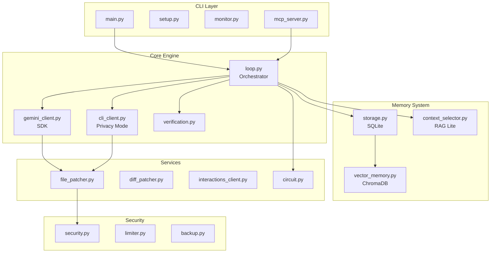

# Boring for Gemini


> **基於 Gemini 驅動的自主 AI 開發代理 (V4.1)，具備 Function Calling、Diff Patching、向量記憶與 Interactions API 支援。**

Boring 是一個自主開發循環系統，利用 **Google Gemini SDK (Python)** 反覆迭代改進您的專案。V4.1 引入了 **Privacy Mode** (無需 API Key)、**SQLite 記憶體**與 **Smart Context (RAG Lite)**，大幅提升隱私性、效能與大型專案處理能力。

---

## 🚀 快速開始

### 前置需求
- **Python 3.9+**
- **Google API Key**: 設定環境變數 `GOOGLE_API_KEY`。
- **(核心建議) ruff & pytest**: 用於進階驗證。
- **(選用) 向量記憶**: `pip install boring-gemini[vector]`

### 1. 安裝與設定

```bash
# 複製並安裝
git clone https://github.com/Boring206/boring-gemini.git
cd boring-gemini
uv tool install . --force

# (可選) 安裝向量記憶支援
pip install -e ".[vector]"

# 安裝推薦的 Gemini Extensions
boring setup-extensions
```

### 2. 啟動開發循環

```bash
# 預設模式 (SDK 模式 + Function Calling + STANDARD 驗證)
boring start

# 進階模式 (開啟詳細日誌 + 全量測試驗證)
boring start --verify FULL --verbose
```

## 🔒 Privacy Mode (無需 API Key)

使用本地 Gemini CLI 而非 API，完全無需設定 `GOOGLE_API_KEY`：

```bash
# 1. 安裝 Gemini CLI
npm install -g @google/gemini-cli

# 2. 登入 (使用 Google 帳號 OAuth)
gemini login

# 3. 以 Privacy Mode 啟動 Boring
boring start --backend cli
```

> 💡 **好處**: 使用您的 Google 帳號免費額度，無需管理 API 金鑰。

## 🔌 IDE 整合 (Cursor / VS Code)

透過 MCP (Model Context Protocol) 將 Boring 整合到 IDE：

### 安裝 MCP 支援

```bash
pip install boring-gemini[mcp]
```

### Cursor Integration

1. 開啟 Cursor Settings → MCP Servers
2. 新增 Server：
   - **Name**: `boring`
   - **Command**: `boring-mcp`
   - **Transport**: `stdio`

### 可用 MCP 工具

| 工具 | 說明 |
|:--|:--|
| `run_boring` | 執行開發任務 |
| `boring_health_check` | 系統健康檢查 |
| `boring_status` | 專案狀態 |
| `boring_verify` | 程式碼驗證 |

## 🧠 V4.0 核心特性

1.  **🔧 Function Calling (穩定性)**:
    - 使用 Gemini 原生結構化輸出取代 Regex 解析
    - 工具：`write_file`、`search_replace`、`report_status`
    - 解析準確率接近 100%
2.  **⚡ Diff Patching (效率)**:
    - 支援 `SEARCH_REPLACE` 區塊進行差異更新
    - 處理 500+ 行檔案無需全量輸出
    - Token 消耗減少 5 倍以上
3.  **🧠 向量記憶 (智能)** `[可選]`:
    - 使用 ChromaDB 儲存學習經驗
    - 語意搜尋找回相似錯誤的解決方案
    - 安裝：`pip install boring-gemini[vector]`
4.  **🚀 Interactions API (前瞻)** `[實驗性]`:
    - 支援有狀態對話（伺服器端記憶）
    - 支援 MCP 伺服器整合
    - 支援最新模型：`gemini-3-flash-preview`
5.  **🛡️ 進階驗證 (驗證)**:
    - **BASIC**: 僅進行 Python 語法檢查。
    - **STANDARD (預設)**: 語法檢查 + `ruff` 靜態分析 + Import 驗證。
    - **FULL**: 標準檢查 + `pytest` 單元測試驗證。
6.  **🔒 Privacy Mode (隱私)** `[V4.1]`:
    - 支援透過 Gemini CLI 執行，完全無需 API Key (OAuth)。
    - 使用個人 Google 帳號免費額度。
7.  **🚀 IDE 整合 (MCP)** `[V4.1]`:
    - 內建 MCP Server，支援 Cursor 與 VS Code。
    - 提供 `run_boring` 等工具與狀態監控資源。

## 🚀 V4.1 架構升級 (Performance)

1.  **🧱 SQLite 核心記憶體**:
    - 取代原有的 JSON 檔案群，解決併發寫入衝突。
    - 支援複雜查詢（如：依錯誤類型統計失敗率）。
    - 包含 `loops`, `errors`, `metrics` 三大核心表格。
2.  **🧠 Smart Context (RAG Lite)**:
    - 專為大型專案設計的 Context 選擇器。
    - 基於 PROMPT 關鍵字 (Camel/Snake Case 支援) 自動篩選相關檔案。
    - 嚴格控制 Token 預算，避免 Context Window 溢出。
3.  **⚡ 模組化與異步核心**:
    - 重構 `core.py` 為 `circuit`, `logger`, `limiter` 獨立模組。
    - 優化語法檢查邏輯：優先檢查變更檔案，大幅提升 Loop 速度。

## 🏗️ 系統架構



## 🔧 故障排除

<details>
<summary><b>API 金鑰錯誤</b></summary>

```bash
# 設定環境變數
export GOOGLE_API_KEY="your-api-key"

# 或在 .env 檔案中
GOOGLE_API_KEY=your-api-key
```
</details>

<details>
<summary><b>Circuit Breaker 開啟</b></summary>

```bash
# 重置 circuit breaker
boring reset-circuit

# 檢查狀態
boring circuit-status
```
</details>

<details>
<summary><b>向量記憶無法使用</b></summary>

```bash
# 安裝可選依賴
pip install boring-gemini[vector]

# 或單獨安裝
pip install chromadb sentence-transformers
```
</details>

## 📋 指令參考

### `boring start` - 啟動開發代理
-   `--verify`: 驗證等級 `BASIC`, `STANDARD`, `FULL`。
-   `--model, -m`: 選擇 Gemini 模型（預設 `gemini-2.0-flash-exp`）。
-   `--use-cli`: 使用 Gemini CLI 取代 SDK。
-   `--calls, -c`: 設定每小時最大 API 調用次數。
-   `--prompt, -p`: 指定自定義 Prompt 檔案。
-   `--timeout, -t`: 設定執行逾時時間（分鐘/每輪）。
-   `--verbose, -v`: 顯示詳細 subsystem 狀態與 Context 大小。

### `boring status` - 查看專案健康度
-   顯示成功/失敗循環統計。
-   顯示最近三輪的歷史摘要與記憶狀態。

### `boring setup-extensions` - 擴展安裝
-   自動安裝 `context7` 與 `criticalthink` 並配置環境。

### `boring memory-clear` - 重置代理狀態
-   清除 `.boring_memory/` 歷史記錄，讓 AI 從頭開始。

### 其他常用指令
-   `boring health`: 🏥 系統健康檢查（API Key、Git、依賴）。
-   `boring version`: 顯示版本資訊。
-   `boring reset-circuit`: 重置斷路器。
-   `boring circuit-status`: 顯示斷路器詳情。

### `boring-setup <NAME>` - 初始化新專案
-   初始化標準專案結構 (包含 `src/`, `PROMPT.md`, `openspec/`)。
-   **支援絕對路徑**: `boring-setup D:\MyProject`
-   **自動注入 Workflow**: 自動將 Spec-Kit 工作流程文件植入新專案，使其具備雙模式支援能力。
-   `boring-monitor`: 啟動即時儀表板。

## �️ TUI 可觀測性儀表板

Boring 提供即時 TUI 儀表板監控開發進度：

```bash
boring-monitor
```

顯示內容：
- 📊 Loop 統計（成功/失敗率）
- ⏱️ 執行時間追蹤
- 📜 即時活動日誌
- 🔌 Circuit Breaker 狀態

## 🤝 Human-in-the-Loop 互動模式

當 Circuit Breaker 觸發（OPEN 狀態）時，Boring 不會直接崩潰，而是進入**互動模式**：

```
┌─────────────────────────────────────┐
│ 🤝 Human-in-the-Loop               │
│                                     │
│ Reason: Circuit Breaker OPEN        │
│                                     │
│ 1. Resume loop                      │
│ 2. Abort and exit                   │
│ 3. Edit PROMPT.md                   │
│ 4. Run a command                    │
│ 5. View recent errors               │
│ 6. View logs                        │
│ 7. Reset circuit breaker            │
└─────────────────────────────────────┘
```

您可以：
- 🔧 檢視錯誤並手動修復問題
- ✏️ 編輯 PROMPT.md 調整指令
- 💻 執行 shell 命令進行除錯
- ♻️ 重置 circuit breaker 後恢復 Loop

## 📁 專案結構 (V4.1)

```
my-project/
├── .gemini/            # [NEW] Gemini CLI 指令擴充 (如 speckit.toml)
├── .boring_memory/      # [NEW] 持久化記憶與 SQLite DB
│   └── memory.db       # ⚡ 核心資料庫 (Loops, Errors, Metrics)
├── .boring_extensions/  # [NEW] 擴展配置與快取
├── PROMPT.md           # 開發核心指令
├── @fix_plan.md        # 任務進度追蹤 (Agent 退出依據)
├── src/                # 專案原始碼 (由 Boring 產生)
└── logs/               # 詳細執行日誌與備份
```

## 規範驅動工作流程 (Spec-Driven Workflow) (AI-Native)

本專案將 Spec-Kit 的核心邏輯內化為 **AI 原生工作流程**，這意味著您**不需要安裝額外的 `specify-cli` 工具**。所有的思考與規劃過程都由 AI 直接執行，無縫整合在 Boring 的開發循環中。

### 執行方式 (雙模式支援)

1.  **AI Chat 模式** (推薦):
    直接與 AI 對話時使用 Slash Command，例如 `/speckit.plan` 或 `/speckit.analyze`。

2.  **Gemini CLI 模式** (需安裝擴展):
    若您偏好終端機操作，執行 `boring setup-extensions` 後，即可使用：
    -   `gemini speckit plan`
    -   `gemini speckit tasks`
    -   `gemini speckit analyze`
    -   `gemini speckit clarify`
    -   `gemini speckit constitution`
    -   `gemini speckit checklist`

### 核心流程：思考 (Spec) -> 執行 (Boring)

1.  **Define (定義需求)**:
    在 `openspec/specs/` 中建立或更新需求文檔。
    
2.  **Plan (制定計畫)**:
    -   `/speckit.constitution`: 建立專案原則 (Constitution)，定義核心價值與品質標準。
    -   `/speckit.plan`: 根據需求與原則，產生高層次的 `IMPLEMENTATION_PLAN.md`。
    -   `/speckit.tasks`: 將計畫拆解為 Boring 可執行的原子任務清單 (`@fix_plan.md`)。

3.  **Execute (執行開發)**:
    -   執行 `boring start`。
    -   Boring 讀取 `@fix_plan.md` 並自動完成所有任務。

4.  **Verify & Clarify (驗證與釐清)**:
    -   `/speckit.analyze`: 分析規格與代碼的一致性。
    -   `/speckit.clarify`: 在動手前釐清規格中的模糊地帶。
    -   `/speckit.checklist`: 產生品質驗收清單。

此流程確保了開發始終遵循 "Spec First" 原則，減少重工並提高代碼品質。

## 🔧 開發相關

如果您想對 Boring 本身進行開發：

1.  **複製儲存庫**: `git clone ...`
2.  **建立虛擬環境**: `python -m venv .venv && source .venv/bin/activate`
3.  **以可編輯模式安裝開發依賴**: `pip install -e ".[dev]"`
4.  **執行測試**: `python -m pytest tests/ -v`
5.  **執行 Linter**: `python -m ruff check src/`

## 💖 致謝與啟發

本專案的優化與架構深受以下傑出專案的啟發，特此鳴謝：

- [github/spec-kit](https://github.com/github/spec-kit) - 啟發了本專案的 **規範驅動開發 (Spec-Driven Development)** 工作流程。
- [frankbria/boring-claude-code](https://github.com/frankbria/boring-claude-code) - 本專案的核心基礎與靈感來源。
- [upstash/context7](https://github.com/upstash/context7) - 提供最新的 library 文件注入。
- [ChromeDevTools/chrome-devtools-mcp](https://github.com/ChromeDevTools/chrome-devtools-mcp) - 提供強大的瀏覽器自動化能力。
- [abagames/slash-criticalthink](https://github.com/abagames/slash-criticalthink) - 啟發了 AI 批判性思考的回饋循環。

---
**準備好讓 AI 幫您構建專案了嗎？** 使用 `uv tool install .` 安裝，讓 Boring 從現在開始接手！ 🚀
