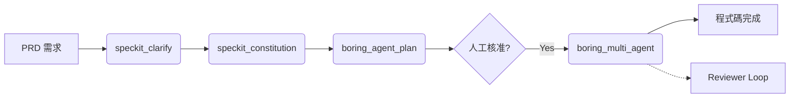
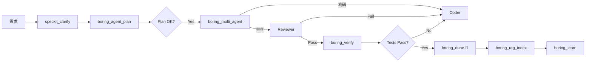

[](https://www.python.org/downloads/)
[](https://github.com/Boring206/boring-gemini)
[]()
[](https://smithery.ai/server/boring/boring)
# Boring for Gemini (V10.5 - Pure CLI Mode)

> **企業級自主 AI 開發代理 (Autonomous Developer)**  
> 專為 Cursor / Claude Desktop / VS Code 打造，利用 Google Gemini 模型驅動的自動化編碼與驗證引擎。
>
> ✅ **Verified Platforms**: Gemini CLI • Antigravity • Cursor • VS Code • Claude Desktop (**Universal MCP Support**)

---

## 🚀 核心優勢 (Why Boring?)

- **🤖 Autonomous & Architect Mode**: 既能自動寫全套程式 (Standalone)，也能作為架構師 (Architect) 指揮您的 IDE AI 協同工作。
- **🔌 Universal MCP Compatibility**: **CLI 與 IDE 完全相容！** 無論是在終端機使用 `gemini` 指令，還是在 Cursor/VS Code 中使用，都能享受完全一致的 MCP 體驗。
- **🔌 Full MCP Support**: 完美整合 Protocol，支援 `context7` (查文件)、`notebooklm` (查知識庫) 與 `criticalthink` (深度思考)。
- **🛡️ 企業級防護**: 內建斷路器 (Circuit Breaker)、自動修復 (Self-Healing) 與 100% 測試覆蓋率。
- **🔌 Local-First Architecture**: 主打 CLI 整合，預設使用本地 `gemini` 指令，無需 API Key 即可運作，資料隱私更有保障。
- **🧩 Spec-Driven Development**: 整合 SpecKit，從 PRD 到 Code 實現 100% 規格一致性。
- **🧠 Advanced RAG Memory**: 內建向量資料庫 (ChromaDB) 與依賴圖 (Graph RAG)，提供精準的語義程式碼搜尋與上下文理解。
- **👥 Multi-Agent Orchestration**: 架構師 (Architect)、工程師 (Coder)、審查員 (Reviewer) 分工協作，自動執行 Plan → Code → Review 循環。
- **🛡️ Shadow Mode Protection**: 人機協作保護機制，所有高風險操作 (刪檔、改配置) 皆需人工批准，確保安全無虞。

---

## ✨ V10 重大更新功能 (New in V10)

### 1. 🧠 Advanced RAG Memory (向量記憶系統)
- **用途**: 解決 AI "忘記程式碼" 或 "找不到相關檔案" 的問題。
- **原理**: 
  - **Vector Search**: 使用 ChromaDB 對全專案程式碼進行語義索引 (不僅僅是關鍵字)。
  - **Graph RAG**: 建立 AST 依賴圖 (Dependency Graph)，AI 修改函數時能自動感知 "誰呼叫了它" (Callers) 和 "它呼叫了誰" (Callees)。
- **工具**: `boring_rag_index` (建立索引), `boring_rag_search` (搜尋), `boring_rag_context` (獲取依賴上下文)。

### 2. 👥 Multi-Agent Orchestration (多代理協作)
- **用途**: 處理複雜任務，避免單一 Prompt 過長導致的混亂。
- **角色**:
  - 🏗️ **Architect**: 專注規劃與設計，產出 Implementation Plan，絕不寫 Code。
  - 👨‍💻 **Coder**: 專注實作，嚴格遵守 Architect 的計畫。
  - 🕵️ **Reviewer (Devil's Advocate)**: 專注找碴，檢查 Bug、安全性漏洞與邊界情況。
- **流程**: 自動執行 Plan → Code → Review 循環，直到 Reviewer 通過 (或達到最大迭代次數)。
- **工具**: `boring_multi_agent` (啟動協作)。

### 3. 🛡️ Shadow Mode (人機協作保護)
- **用途**: 讓 AI 擁有 "Root 權限" 的同時保障安全。
- **機制**:
  - **Auto-Approve**: 讀取 (Read) 操作永遠自動放行。
  - **Shadow Block**: 高風險操作 (刪檔、修改 Config、修改 Secrets) 會被攔截，進入 "Pending" 狀態。
  - **Human-in-the-Loop**: 開發者可透過 `boring_shadow_status` 查看並批核 (`approve`) 或拒絕 (`reject`)。
- **工具**: `boring_shadow_mode` (設定模式), `boring_shadow_approve`。

### 4. 🚀 V10.6 新增功能 (New Functionality)
- **Ruff Auto-Fix**: `boring_verify` 新增 `auto_fix=True` 參數，自動修復 Lint 問題。
- **Semantic Commits**: `boring_commit` 自動生成語意化 Git 提交訊息。
- **Architecture Visualization**: `boring_visualize` 生成 Mermaid 架構圖。
- **Optimized for Claude**: `run_boring` 為 Claude CLI 優化，提供更清晰的引導。

### 5. 🛠️ Phase 4 Optimization (V10.7 Full Release)
- **Robust SpecKit**: 使用 Pydantic 進行嚴格的工作流架構驗證 (Schema Validation)。
- **CoT Routing**: `boring_delegate` 採用 Chain-of-Thought (思維鏈) 提示，提升任務分派的準確度。
- **Telemetry**: 完整的 `boring_delegate` 使用量監控。

### 6. 🏛️ Phase 4.5 Architect Mode (V10.9)
- **Hostile Architect**: `boring_evaluate` 現在包含 "Production Level" 評估，模擬嚴格的架構師審查（Concurrency, Scalability）。
- **CLI Tool Support**: 支援 Pure CLI 模式下的工具調用（如 Web Search），不再受限於 API。
- **Tools**: `evaluate_architecture` (MCP), `boring_web_search`.

### 7. 🌐 Polyglot & Advanced Eval (V10.10)
- **Deep Polyglot Parsing**: 整合 **Tree-sitter**，精準解析 Python, JS/TS, Go, Rust, Java, C/C++ 的語意結構。
- **Universal Verifier**: `CodeVerifier` 支援通用 CLI 工具分發 (例如 `.go` -> `golangci-lint`)。
- **Unbiased Judge**: `LLMJudge` 新增偏誤消除機制 (Bias Mitigation) 與信心分數 (Confidence Score)，評分更公正透明。
- **Actionable Roadmap**: 評估結果現在包含 **Strategic Advice** (長期戰略) 與 **First Step** (立即行動)，直接指導架構優化方向。
- **Language-Aware Prompts**: 自動注入語言專屬的最佳實踐 (如 Go idioms, PEP 8) 到評審提示中。

---

## ⚠️ V10.5 重大變更 - Pure CLI Mode

> **重要架構說明**：在 MCP 模式下（透過 Cursor/VS Code/Claude Desktop 使用），以下工具**不會直接執行 AI 操作**，而是返回「工作流程模板」和 CLI 命令供您外部執行：

| 工具 | MCP 模式行為 | 執行方式 |
|------|-------------|----------|
| `run_boring` | 返回 CLI 命令模板 | 使用 `boring start` 在終端機執行 |
| `boring_multi_agent` | 返回多步驟 CLI 模板 | 依序執行每個步驟的命令 |
| `speckit_plan/tasks` | 返回工作流程模板 | 使用 `gemini --prompt` 或 IDE AI 執行 |
| `boring_auto_fix` | 執行驗證 + 返回修復命令 | 使用返回的 prompt 手動修復 |

**原因**：MCP 環境無法同時作為 AI 調用者和被調用者。真正的自主執行需透過 `boring start` CLI 命令。

**正常工作的工具**：`boring_verify`, `boring_health_check`, `boring_rag_*`, `boring_apply_patch`, `boring_status`, 等輔助工具。

### 📌 環境變數設定指南 (Client Configuration)

不同的客戶端對環境變數的需求不同：

| Client | `BORING_MCP_MODE` | 說明 |
|--------|-------------------|------|
| **Gemini CLI** | ❌ 不需要 | 原生支援，無需特別設定。 |
| **Claude Desktop** | ✅ **必須設定為 "1"** | 需明確告知處於 MCP 模式，以啟用模板回傳機制。 |
| **Cursor / VS Code** | ✅ **必須設定為 "1"** | 同上。 |
| **Smithery** | ✅ **建議設定為 "1"** | 確保其作為被動工具運作 (Smithery 預設通常會注入)。 |

---


## 📦 安裝指南 (Installation)

請選擇適合您的方式：

### 推薦方式：Smithery (一鍵部署，免 Python 環境)
最適合 **Cursor** 或 **Claude Desktop** 使用者。

> 📖 **詳細說明**: [https://server.smithery.ai/boring/boring](https://server.smithery.ai/boring/boring)

1.  **安裝本體**:
    ```bash
    npx @smithery/cli install boring-gemini
    ```

2.  **配置配套服務 (⚠️ 重要 / Required)**:
    Boring 的部分核心功能依賴外部 MCP Server。請務必在您的 IDE 設定檔 (`claude_desktop_config.json` 或 Cursor 設定) 中加入以下**完整配置**：

    ```json
    {
      "mcpServers": {
        "boring": {
          "command": "npx",
          "args": ["-y", "@smithery/cli", "run", "@boring/boring", "--config", "{}"]
        },
        "context7": {
          "command": "npx",
          "args": ["-y", "@upstash/context7-mcp"]
        },
        "criticalthink": {
          "command": "npx",
          "args": ["-y", "@modelcontextprotocol/server-sequential-thinking"]
        },
        "notebooklm": {
          "command": "npx",
          "args": ["-y", "notebooklm-mcp@latest"]
        }
      }
    }
    ```
    > **注意**: `notebooklm` 需要登入，初次使用請執行 `npx -y notebooklm-mcp@latest setup_auth` 完成 Google 認證。

### 方式二：手動安裝到 Cursor / Antigravity (推薦 / IDE 專用)

若 Smithery 暫時不可用，您可以使用本機 Python 環境直接載入：

1.  **確保已安裝 Boring**:
    ```bash
    pip install -e .(安裝核心)
    pip install ".[gui]"(安裝 GUI)
    pip install ".[all]"  # 安裝所有功能 (含 MCP + Dashboard + 向量記憶)
    ```

    > **注意**: 
    > * **本地監控 (TUI)**: 執行 `boring-monitor` 可開啟終端機版儀表板 (輕量、快速)。
    > * **Web Dashboard (網頁版)**: 執行 `boring-dashboard` 可開啟圖形化儀表板 (需安裝 `.[gui]`)。安裝後即可在任何專案目錄執行，且不再依賴原始原始碼目錄。
    > * **Smithery 部署**: 雲端環境通常僅作為 MCP Server 運作，不需要安裝 GUI 套件，故 Smithery 設定僅需核心功能 (`.[mcp]`) 即可，無法直接存取 Dashboard。

2.  **取得 Python 執行路徑**:
    在終端機執行 `where python` (Windows) 或 `which python` (Mac/Linux)，記下路徑（例如：`C:\Python312\python.exe`）。

3.  **配置 MCP 設定**:
    在 **Antigravity** (`mcp_config.json`) 或 **Cursor** (MCP 設定面板) 中加入以下配置：

    ```json
    {
      "mcpServers": {
        "boring": {
          "command": "python", 
          "args": ["-m", "boring.mcp.server"],
          "env": {
            "PYTHONPATH": "您的_boring-gemini_專案絕對路徑"
          }
        },
        "context7": {
          "command": "npx",
          "args": ["-y", "@upstash/context7-mcp"]
        },
        "criticalthink": {
          "command": "npx",
          "args": ["-y", "@modelcontextprotocol/server-sequential-thinking"]
        },
        "notebooklm": {
          "command": "npx",
          "args": ["-y", "notebooklm-mcp@latest"]
        }
      }
    }
    ```
    > **💡 提示**: 將 `python` 替換為步驟 2 取得的絕對路徑，`PYTHONPATH` 設為您 `boring-gemini` 資料夾的絕對路徑。


### 開發者方式：Python Source (適合貢獻代碼)

```bash
# Clone & Install (Lightweight Default)
git clone https://github.com/Boring206/boring-gemini.git
cd boring-gemini
pip install -e .

# Install with Dashboard Support
pip install -e ".[gui]"

# Install for Development
pip install -e ".[dev]"

# 安裝擴展
boring setup-extensions
```

---

## 🛠️ 功能與指令 (Features & Usage)

安裝完成後，您可以在 Chat 中直接與 AI 互動，或使用以下工具：

### 1. 核心工具 (Agent Tools)

| 工具名稱 | 用途 |
| :--- | :--- |
| **`run_boring`** | **返回 CLI 命令模板**。在 MCP 模式下返回 `boring start` 命令，需在終端機執行。 |
| **`boring_quickstart`** | 🆕 **新手引導**。取得推薦步驟和可用工具清單。 |
| **`boring_verify`** | 🛡️ **程式碼驗證**。支援 4 種級別 (見下方說明)。 |
| **`boring_health_check`** | 檢查系統健康狀態。 |
| **`boring_done`** | 🔔 完成通知。Agent 完成任務時呼叫，會發送 **Windows 桌面通知**。 |
| **`boring_learn`** | 🧠 **經驗學習**。從 `.boring_memory` 提取成功模式到 `.boring_brain`。 |
| **`boring_evaluate`** | 📊 **Advanced Evaluation**。使用 LLM-as-a-Judge 評估代碼品質。 |
| **`boring_dashboard`** | 👁️ **Visual Monitor**。啟動 Web UI 監控面板 (`localhost:8501`)。 |
| **`boring_create_rubrics`** | 創建評估標準 (LLM-as-a-Judge)。 |
| **`boring_brain_summary`** | 查看知識庫摘要。 |
| **`boring_hooks_install`** | 安裝 Git Hooks (pre-commit + pre-push)。 |
| **`boring_hooks_uninstall`** | 移除 Git Hooks。 |
| **`boring_hooks_status`** | 查看 Hook 安裝狀態。 |

### 1.1 🔌 V9 新功能 (V9.0 New Features) 🆕

| 工具名稱 | 用途 |
| :--- | :--- |
| **`boring_auto_fix`** | 🔧 **驗證 + 修復模板**。執行驗證並返回修復命令模板。 |
| **`boring_suggest_next`** | 🧠 **智慧建議**。根據專案狀態推薦下一步動作。 |
| **`boring_workspace_add`** | 📂 新增專案到工作區。 |
| **`boring_workspace_remove`** | 📂 從工作區移除專案。 |
| **`boring_workspace_list`** | 📂 列出工作區所有專案。 |
| **`boring_workspace_switch`** | 📂 切換當前活動專案。 |
| **`boring_list_plugins`** | 🔌 列出已註冊的外掛。 |
| **`boring_run_plugin`** | 🔌 執行指定外掛。 |
| **`boring_reload_plugins`** | 🔌 熱載入已變更的外掛。 |
| **`boring_get_progress`** | 📊 取得執行中任務的進度。 |

### 1.2 🤖 Local Teams (Git Hooks)

本地版 "Boring for Teams"！透過 Git Hooks 在 commit/push 前自動驗證代碼。

```bash
# 安裝 Hooks
boring hooks install

# 查看狀態
boring hooks status

# 移除 Hooks
boring hooks uninstall
```

| Hook | 觸發時機 | 驗證級別 |
|------|----------|----------|
| `pre-commit` | 每次 commit | `STANDARD` (語法 + Lint) |
| `pre-push` | 每次 push | `FULL` (語法 + Lint + 測試) |

> 💡 **工作原理**: Hook 呼叫 `boring verify`，而 `boring verify` 靠 **[Ruff](https://docs.astral.sh/ruff/)** (超快的 Python Linter) 來定義什麼是「好代碼」。

#### 📝 自訂規則 (可選)

在專案根目錄建立 `ruff.toml` 來客製化 Lint 規則：

```toml
# ruff.toml
line-length = 120  # 允許更長的行

[lint]
ignore = [
    "T201",  # 允許 print()
    "F401",  # 允許未使用的 import
]
```

### 1.3 🔌 Plugin System (V9.0 New) 🆕

在不修改核心代碼的情況下，輕鬆擴展 Boring 的功能。

#### 📁 Plugin 目錄
- **專案級**: `{project_root}/.boring_plugins/` (優先)
- **全域級**: `~/.boring/plugins/`

#### ✍️ 創建 Plugin

```python
# ~/.boring/plugins/my_linter.py
from boring.plugins import plugin

@plugin(
    name="my_custom_linter",
    description="自訂 Lint 規則",
    version="1.0.0",
    author="Your Name",
    tags=["lint", "validation"]
)
def my_custom_linter(file_path: str) -> dict:
    """驗證檔案並返回結果。"""
    # 您的邏輯
    issues = []
    if "TODO" in open(file_path).read():
        issues.append({"line": 1, "msg": "Found TODO comment"})
    
    return {"passed": len(issues) == 0, "issues": issues}
```

#### 🚀 使用 Plugin

| 工具 | 說明 |
|------|------|
| `boring_list_plugins` | 列出所有已註冊 Plugin |
| `boring_run_plugin(name="my_custom_linter", file_path="test.py")` | 執行指定 Plugin |
| `boring_reload_plugins` | 熱載入 (檔案變更後自動載入) |

#### 📦 實用 Plugin 範例

```python
# 自動格式化 imports
@plugin(name="sort_imports", description="排序 import 語句")
def sort_imports(file_path: str) -> dict:
    import subprocess
    result = subprocess.run(["isort", file_path], capture_output=True)
    return {"status": "SUCCESS" if result.returncode == 0 else "ERROR"}

# 統計程式碼行數
@plugin(name="line_counter", description="計算程式碼行數")
def line_counter(directory: str = ".") -> dict:
    from pathlib import Path
    total = sum(1 for f in Path(directory).rglob("*.py") for _ in open(f))
    return {"total_lines": total}
```

---

### 1. 核心工具 (Core Tools)

| 工具名稱 | 用途 |
| :--- | :--- |
| **`run_boring`** | **主要入口**。給它一個任務描述，它會自動規劃並執行。 |
| **`boring_quickstart`** | 🆕 **新手引導**。取得推薦步驟和可用工具清單。 |
| **`boring_verify`** | 🛡️ **程式碼驗證**。支援 4 種級別 (見下方說明)。 |
| **`boring_health_check`** | 檢查系統健康狀態。 |
| **`boring_done`** | 🔔 完成通知。Agent 完成任務時呼叫，會發送 **Windows 桌面通知**。 |

### 2. SpecKit 工作流 (Spec-Driven Development) 🆕

透過標準化工作流，將需求轉化為高品質代碼。

| 工具名稱 | 說明 |
| :--- | :--- |
| **`speckit_plan`** | 🗺️ **規劃模板**。返回工作流程模板，需用 CLI 或 IDE AI 執行。 |
| **`speckit_tasks`** | 📝 **拆解模板**。返回任務拆解的工作流程模板。 |
| **`speckit_analyze`** | 🔍 **分析模板**。返回一致性檢查的工作流程模板。 |
| **`speckit_clarify`** | ❓ **釐清模板**。返回需求釐清的工作流程模板。 |
| **`speckit_checklist`** | ✅ **檢查表模板**。返回驗收清單生成的工作流程模板。 |
| **`speckit_constitution`** | 📜 **憲章模板**。返回專案準則建立的工作流程模板。 |

**進階工作流管理**:
- `speckit_evolve_workflow`: 為專案客製化工作流 (例如：針對 React 專案修改 Plan 模板)。
- `speckit_reset_workflow`: 恢復預設工作流。
- `speckit_backup_workflows`: 備份當前工作流設定。

### 3. 本地團隊協作 (Local Teams) 🆕

透過 Git Hooks 在 commit/push 前自動驗證代碼。

```bash
boring hooks install    # 安裝 Hooks
boring hooks status     # 查看狀態
boring hooks uninstall  # 移除 Hooks
```

- **pre-commit**: 執行 `boring verify --level STANDARD` (語法 + Lint)
- **pre-push**: 執行 `boring verify --level FULL` (語法 + Lint + 測試)

### 4. 大腦與學習 (Brain & Learning) 🧠

Boring 具備記憶與自我進化能力。

| 工具名稱 | 說明 |
| :--- | :--- |
| **`boring_learn`** | 彙整記憶，將成功模式提取至長期記憶 (`.boring_brain`)。 |
| **`boring_evaluate`** | **LLM-as-a-Judge**。評估代碼品質 (支援 Direct Scoring 與 Pairwise Comparison)。 |
| **`boring_create_rubrics`**| 創建評估標準 (Rubrics) 供 Judge 使用。 |
| **`boring_brain_summary`** | 查看當前知識庫摘要 (已學模式、Rubrics 數量)。 |

### 5. 整合與擴展 (Integration & Extensions) 🔌

| 工具名稱 | 說明 |
| :--- | :--- |
| **`boring_setup_extensions`**| 一鍵安裝推薦擴展 (Context7, NotebookLM 等)。 |
| **`boring_notebooklm_guide`**| 取得 NotebookLM 整合與認證指南。 |
| **`boring_install_workflow`**| 從網址或檔案安裝社群分享的工作流 (.bwf.json)。 |
| **`boring_export_workflow`** | 將你的工作流打包分享。 |
| **`boring_apply_patch`** | 精準代碼修改 (不啟動完整 Agent Loop)。 |

---

### 🎓 專家級技巧 (Pro Tips)

#### 💡 Tip 1: 善用 SpecKit "三部曲"
在開始寫代碼前，依序執行這三個工具，能大幅降低錯誤率：
1. `speckit_clarify` (釐清需求)
2. `speckit_plan` (制定計畫)
3. `speckit_checklist` (建立驗收標準)
**這就是 "Measure Twice, Cut Once" 的 AI 實踐！**

#### 💡 Tip 2: 讓已學經驗發揮作用
定期執行 `boring_learn`。下次執行任務時，Agent 會自動參考 `.boring_brain/learned_patterns` 中的成功案例，避免犯同樣的錯誤。

#### � Tip 3: 自定義你的 AI 裁判
覺得預設的代碼檢查太寬鬆？
1. 修改 `.boring_brain/rubrics/code_quality.json`
2. 使用 `boring_evaluate(..., level="DIRECT")`
3. AI 將會依據**你的標準**來評分！

#### 💡 Tip 4: 混合開發模式
- 小修改？直接用 `boring_apply_patch`。
- 大功能？用 `run_boring`。
- 寫完不確定？用 `boring_evaluate` 打分數。

| `STANDARD` | 語法 + Lint (Ruff) | 🔵 中等 |
| `FULL` | 語法 + Lint + Import 檢查 + 測試 | 🟠 較慢 |
| `SEMANTIC` | 以上全部 + **LLM 評估程式碼品質** | 🔴 最慢但最完整 |

> 💡 `SEMANTIC` 級別會使用 LLM-as-Judge 評估可讀性、安全性、架構品質。

#### 🧠 `boring_learn` — 經驗學習系統

從 `.boring_memory` 資料庫中提取成功解決問題的模式，儲存到 `.boring_brain` 知識庫：

```
開發過程 → AI 遇錯並修復 → 記錄到 .boring_memory
專案結束 → 執行 boring_learn → 提取成功模式到 .boring_brain
下次專案 → AI 自動參考學過的模式！
```

> 💡 建議在專案完成後執行 `boring_learn`，讓 AI 累積經驗變得更聰明！

### 2. SpecKit 工作流 (Spec-Driven)

Boring 採用 **Spec-Driven Development**，確保程式碼與需求 100% 一致。

| 工具名稱 | 用途 |
| :--- | :--- |
| **`speckit_plan`** | 根據 PRD 生成 `IMPLEMENTATION_PLAN.md`。 |
| **`speckit_tasks`** | 將計畫拆解為 `task.md`。 |
| **`speckit_analyze`** | 比對 Code 與 Spec 的一致性 (Consistency Check)。 |
| **`speckit_constitution`** | 建立專案核心原則與開發準則。 |
| **`speckit_clarify`** | AI 反問模式，釐清模糊需求。 |
| **`speckit_checklist`** | 生成品質驗證檢查清單。 |

#### 📐 標準開發流程 (V10 Multi-Agent)



### 2.1 🌐 Boring Hub (Workflow Ecosystem) 🆕

Boring V7.0 引入了 **Workflow Sharing** 生態系，支援 **Serverless Registry (GitHub Gist)**，您可以將最佳實踐像 `npm publish` 一樣發布。

| 工具名稱 | 用途 |
| :--- | :--- |
| **`boring_export_workflow`** | 打包工作流為 `.bwf.json`。 |
| **`boring_install_workflow`** | 從 Gist URL 或檔案安裝工作流。 |
| **`boring workflow publish`** | **[NEW]** 一鍵發布到 GitHub Gist，自動生成分享連結。 |

#### 📦 如何分享經驗 (Publish & Share)

**CLI 快速發布：**
```bash
# 1. 發布 (需 GITHUB_TOKEN - 權限: gist)
#    申請連結: https://github.com/settings/tokens/new?scopes=gist&description=Boring+CLI
boring workflow publish speckit-plan --token ghp_xxxx

# 輸出：
# ✓ Published Successfully!
# Scan this to install:
# boring workflow install https://gist.githubusercontent.com/... (Raw Gist URL)
# 
# 💡 如果忘了 URL，可到 Gist 頁面點擊 "Raw" 按鈕獲取 (需為 .bwf.json 內容)
```

**MCP 對話模式：**
> AI: "幫我把目前的 security-check 工作流發布到 Gist 分享給大家"
2. **Distribute**: 將生成的 `speckit-plan.bwf.json` 上傳到 GitHub Gist 或任何 HTTP Server。
3. **Install**:
   - 別人只需執行：`boring workflow install https://.../speckit-plan.bwf.json`
   - 或對 AI 說：*"幫我從這個 URL 安裝工作流..."*

> 💡 **Boring Hub 願景**: 讓全世界的開發者不再重複造輪子，直接使用由專家驗證過的高效開發流程！

### 2.2 動態工作流程演化 (Workflow Evolution) 🆕

AI 可根據專案需求 **動態修改** SpecKit 工作流程，實現「自適應開發」。

| 工具名稱 | 用途 |
| :--- | :--- |
| **`speckit_evolve_workflow`** | 修改工作流程內容以適應專案。 |
| **`speckit_reset_workflow`** | 回滾到原始模板。 |
| **`speckit_backup_workflows`** | 備份所有工作流程到 `_base/`。 |
| **`speckit_workflow_status`** | 查看工作流程演化狀態。 |

#### 🧬 演化機制 (Fork -> Evolve -> Rollback)

當您發現預設流程不適用時（例如：需要特殊的 Security Check）：

1. **Evolve**: 呼叫 `speckit_evolve_workflow` 修改 `checklist.md`。
2. **Backup**: 系統自動將原始 `checklist.md` 備份到 `_base/`。
3. **Use**: 之後 AI 會使用新的、強化版的工作流程。
4. **Learn**: 這些修改會被記錄，成為未來專案的經驗。

> 💡 **Pro Tip**: 不同類型的專案（Web, CLI, Data）應該演化出不同的工作流程！

#### 💻 CLI 快速指令 (New)

如果您有安裝擴展 (setup-extensions)，可以直接在終端機操作：

```bash
# 修改工作流
gemini speckit evolve

# 回滾工作流
gemini speckit reset
```

#### 🧩 IDE (MCP Mode) 操作

如果您是在 **Cursor / VS Code / Claude Desktop** 中使用：

直接對 AI 下指令即可 (MCP 會呼叫 `speckit_reset_workflow`)：

> "把 speckit-checklist 重置回預設值"
> "Restore speckit-plan to original state"

### 3. 微操作 (Granular Tools)

提供給高階用戶的「手術刀級」工具，適合精確控制。

| 工具名稱 | 用途 |
| :--- | :--- |
| **`boring_apply_patch`** | 精確修改檔案 (Search/Replace)，支援 fuzzy match。 |
| **`boring_verify_file`** | 單檔快速驗證，不需掃描全專案。 |
| **`boring_extract_patches`** | 從 AI 輸出中萃取並套用程式碼。 |

#### Agent Mode vs Micro Mode

| 模式 | 適用情境 | 推薦工具 |
|------|----------|----------|
| **Agent Mode** | 需要規劃、多檔案連動、複雜重構 | `run_boring`, SpecKit Tools |
| **Micro Mode** | 單一檔案修復、明確的小修改、Code Review | `apply_patch`, `verify_file` |

> 💡 **Pro Tip**: 在使用 **Cursor Composer** 或 **Claude Artifact** 時，Micro Tools 特別好用，因為您可以自己控制流程，只讓 Boring 負責「寫入」和「驗證」。

---

## 💡 使用範例

### 快速開始
```
你: 請幫我建立一個 TypeScript API 專案的規劃
AI: (呼叫 speckit_plan) 生成 implementation_plan.md...
```

### 動態演化工作流程
```
你: 這個專案需要特別強調安全測試，請調整 speckit-checklist 工作流程
AI: (呼叫 speckit_evolve_workflow) 已修改 speckit-checklist.md，
    添加了 OWASP Top 10 安全檢查項目...
```

### 使用記憶系統
```
你: 上次解決類似問題的方式是什麼？
AI: (查詢 .boring_memory) 找到 3 個相關經驗，建議使用...
```

---

## 📋 開發 Prompt 範本 (Copy & Paste)

> 複製以下 Prompt 直接貼上聊天，快速啟動開發！

### 🆕 新專案啟動

```
請使用 Boring MCP 幫我規劃一個新專案：

專案名稱：[你的專案名稱]
技術棧：[例如：Next.js 14 + TypeScript + Prisma + PostgreSQL]
核心功能：
1. [功能一]
2. [功能二]
3. [功能三]

請依序執行：
1. speckit_plan - 產出實作計劃
2. speckit_tasks - 拆解為任務清單
3. 等我確認後開始實作
```

### 🔧 重構現有程式碼

```
請使用 Boring MCP 重構以下程式碼：

目標檔案：[路徑]
重構目標：
- [ ] 提升可讀性
- [ ] 拆分過長函數
- [ ] 加入錯誤處理
- [ ] 補充 TypeScript 型別

請先執行 boring_verify 檢查現況，
再用 boring_apply_patch 逐步修改。
```

### 🐛 Debug 流程

```
我遇到了一個問題：

錯誤訊息：[貼上錯誤訊息]
發生位置：[檔案路徑和行數]
預期行為：[應該發生什麼]
實際行為：[實際發生什麼]

請使用 criticalthink 分析問題根因，
然後用 boring_apply_patch 修復。
```

### 📚 學習新技術

```
我想在這個專案中使用 [技術名稱，例如：Zustand 狀態管理]

請幫我：
1. 使用 context7 查詢最新文件
2. 用 speckit_plan 規劃整合方案
3. 產出具體的實作步驟
```

### 🧪 補充測試

```
請幫我補充測試：

目標檔案：[路徑]
測試框架：[例如：Vitest / Jest / Pytest]
需要覆蓋：
- [ ] Happy path
- [ ] Edge cases
- [ ] Error handling

先用 boring_verify 檢查現有覆蓋率，
再產出測試程式碼。
```

### 🏗️ 全自動開發模式

```
請使用 run_boring 自動完成以下任務：

任務描述：[詳細描述你要做的事]
驗證級別：STANDARD
完成後請發送 boring_done 通知我。
```

### 🔍 程式碼審查

```
請審查以下程式碼的品質：

目標檔案：[路徑或貼上程式碼]

請使用 boring_verify SEMANTIC 進行評估，
並根據以下 Rubrics 給出建議：
- code_quality
- security  
- architecture
```

### 📝 API 設計

```
請幫我設計 RESTful API：

資源名稱：[例如：User, Product, Order]
需要的端點：
- GET /[resource] - 列表
- POST /[resource] - 新增
- GET /[resource]/:id - 單筆
- PUT /[resource]/:id - 更新
- DELETE /[resource]/:id - 刪除

請用 speckit_plan 產出 API 規格，
包含 Request/Response Schema。
```

---

## 🔌 各 MCP Server 專用 Prompt

> 學會對每個 MCP 下正確的指令，讓 AI 發揮最大效能！

### 🤖 Boring MCP (自主開發代理) — 完整 Prompt 指南

**核心用法**：Boring 是主力開發工具，負責規劃、執行、驗證。

#### 📋 SpecKit 工作流工具

```
# speckit_plan — 規劃專案
"使用 speckit_plan 規劃一個 Next.js 14 電商網站，包含購物車、結帳、會員系統"
"使用 speckit_plan 規劃重構 legacy PHP 系統到 Node.js 的遷移方案"

# speckit_tasks — 拆解任務
"使用 speckit_tasks 將 implementation_plan.md 拆解為可執行的任務清單"
"使用 speckit_tasks 產出任務，每個任務要包含驗證標準"

# speckit_analyze — 一致性檢查
"使用 speckit_analyze 檢查目前程式碼是否符合 spec.md 規格"
"使用 speckit_analyze 找出 implementation_plan.md 和實際程式碼的差距"

# speckit_clarify — 釐清需求
"使用 speckit_clarify 分析這個需求的模糊之處，提出澄清問題"
"這個 PRD 還不夠清楚，用 speckit_clarify 問我問題"

# speckit_constitution — 建立準則
"使用 speckit_constitution 建立這個專案的開發準則和品質標準"

# speckit_checklist — 產出檢查表
"使用 speckit_checklist 產出上線前的品質檢查清單"
```

#### 🔄 動態工作流程演化

```
# speckit_evolve_workflow — 修改工作流程
"使用 speckit_evolve_workflow 修改 speckit-plan，
 加入 API 文件規範：每個 endpoint 必須定義 Request/Response Schema"

"使用 speckit_evolve_workflow 修改 speckit-checklist，
 加入 OWASP Top 10 安全檢查項目"

# speckit_reset_workflow — 回滾
"使用 speckit_reset_workflow 將 speckit-plan 還原為預設版本"

# speckit_backup_workflows — 備份
"使用 speckit_backup_workflows 備份所有工作流程"

# speckit_workflow_status — 查看狀態
"使用 speckit_workflow_status 查看 speckit-plan 的演化歷史"
```

#### 🚀 核心執行工具

```
# run_boring — 自動開發 (最強指令)
"使用 run_boring 自動完成：建立 Express.js REST API with TypeScript"
"使用 run_boring 完成 task.md 中的第一個任務"
"使用 run_boring 實作登入功能，使用 JWT + bcrypt"

# boring_verify — 專案驗證
"使用 boring_verify BASIC 快速檢查語法錯誤"
"使用 boring_verify STANDARD 執行 Lint + 測試"
"使用 boring_verify FULL 完整驗證包含 import 檢查"
"使用 boring_verify SEMANTIC 用 LLM 評估程式碼品質"

# boring_verify_file — 單檔驗證
"使用 boring_verify_file 快速驗證 src/utils/auth.ts"
```

#### ✏️ 程式碼修改工具

```
# boring_apply_patch — 精確修改
"使用 boring_apply_patch 將 src/api/users.ts 中的
 'const users = []' 改成 'const users: User[] = []'"

"使用 boring_apply_patch 修改 src/config.ts，
 將 API_URL 從 localhost 改成環境變數"

# boring_extract_patches — 萃取並套用
"使用 boring_extract_patches 從上面的程式碼區塊萃取修改並套用"
```

#### 🧠 學習與知識管理

```
# boring_learn — 提取學習模式
"使用 boring_learn 從 .boring_memory 提取成功解決問題的模式"

# boring_create_rubrics — 建立評估標準
"使用 boring_create_rubrics 建立預設評估標準"

# boring_brain_summary — 查看知識庫
"使用 boring_brain_summary 查看目前學到了什麼模式"
```

#### 🔧 系統工具

```
# boring_health_check — 健康檢查
"使用 boring_health_check 確認系統是否正常"

# boring_quickstart — 新手引導
"使用 boring_quickstart 獲取使用指南"

# boring_status — 專案狀態
"使用 boring_status 查看目前專案的 Boring 狀態"

# boring_done — 完成通知
"任務完成後使用 boring_done 發送桌面通知"

# boring_list_workflows — 列出工作流程
"使用 boring_list_workflows 查看所有可用的工作流程"
```

---

### 📚 Context7 MCP (即時文件查詢)

**核心用法**：查詢最新的程式庫文件，不依賴過時的訓練資料。

```
# 基本查詢
"使用 context7 查詢 React 19 的 use() hook 用法"

# 特定版本
"使用 context7 查詢 Next.js 14 的 Server Actions 範例"

# 比較差異
"使用 context7 查詢 Prisma 5 和 Prisma 4 的差異"

# 遷移指南
"使用 context7 查詢 Vue 2 to Vue 3 migration guide"

# 最佳實踐
"使用 context7 查詢 TypeScript 5 的最佳實踐"

# 錯誤解決
"使用 context7 查詢 Next.js 的 'Cannot read properties of null' 解法"
```

---

### 🧠 CriticalThink MCP (深度邏輯分析)

**核心用法**：處理複雜問題，需要多步推理，避免 AI 胡說八道。

```
# 分析問題
"使用 criticalthink 分析這個 Bug 的根本原因：[錯誤描述]"

# 設計決策
"使用 criticalthink 比較 Redux vs Zustand vs Jotai，
 考慮我的專案規模是 [大/中/小]，團隊人數 [N] 人"

# 架構設計
"使用 criticalthink 分析這個微服務架構的優缺點：
 [貼上架構圖或描述]"

# 效能瓶頸
"使用 criticalthink 逐步分析這個 SQL 查詢為什麼慢：
 [貼上 SQL]"

# 重構策略
"使用 criticalthink 分析這個 legacy code 的重構策略，
 風險評估和執行順序"

# 技術選型
"使用 criticalthink 分析 PostgreSQL vs MongoDB 對於 [使用場景] 的適合度"
```

---

### 📔 NotebookLM MCP (專案知識庫)

**核心用法**：查詢你上傳到 NotebookLM 的專案文件、規格書、會議紀錄。

```
# 查詢知識庫
"使用 notebooklm 查詢我們的 API 規格中，User 欄位有哪些"

# 對照規格
"使用 notebooklm 確認這個實作是否符合 PRD 需求"

# 查詢歷史
"使用 notebooklm 查詢上次會議決定的技術選型"

# 尋找定義  
"使用 notebooklm 查詢 '高優先' 的定義是什麼"

# 驗證一致性
"使用 notebooklm 確認 implementation_plan.md 與 PRD 是否一致"

# 設定知識庫
"使用 notebooklm add_notebook 添加這個 URL：[NotebookLM 分享連結]"
```

---

### 🔗 MCP 組合技 (殺手級用法)

**最強工作流程**：組合多個 MCP 達成複雜任務！

```
# 技術研究 + 實作
"先用 context7 查詢 Stripe API 的 Webhook 處理方式，
 再用 speckit_plan 規劃付款系統實作"

# 深度分析 + 自動修復
"先用 criticalthink 分析這個 race condition 問題，
 再用 boring_apply_patch 實作修復"

# 知識庫 + 一致性檢查
"先用 notebooklm 查詢 PRD 需求，
 再用 speckit_analyze 檢查程式碼是否符合規格"

# 全流程自動化
"先用 context7 查詢 [技術] 最佳實踐，
 用 criticalthink 設計架構，
 用 speckit_plan 產出計劃，
 用 speckit_tasks 拆解任務，
 用 run_boring 自動執行，
 最後用 boring_done 通知我"
```

---

## 🌍 Gemini CLI 整合

如果您偏好在終端機使用 Gemini CLI，可以將 Smithery 版 Boring 註冊進去：

```bash
gemini mcp add boring npx -- -y @smithery/cli run boring-gemini
```
註冊後即可在終端機對話：「請用 boring 幫我重構這個資料夾...」。

---

## 🧠 進階使用技巧：讓 AI Coding 進化 (Pro Tips)

> **核心哲學**: Boring 不只是工具，它是你的 **AI 開發副駕駛**。正確使用它，可以讓你的編碼效率提升 10 倍。

### 🎯 Tip 1: 三階段工作法 (Plan → Task → Execute)

不要直接讓 AI 寫程式碼！使用 **SpecKit 流程** 確保品質：

```
Step 1: speckit_plan → 產出 implementation_plan.md
Step 2: speckit_tasks → 拆解為可追蹤的 task.md
Step 3: run_boring 或讓 IDE AI 依任務執行
```

**為什麼這樣做？** 先規劃再執行，AI 不會亂寫、不會遺漏、不會重複。

---

### 🔄 Tip 2: 動態演化工作流程 (Workflow Evolution)

每個專案都不同！使用 `speckit_evolve_workflow` 讓工作流程適應你的專案：

```
# React 專案？加入 Component 結構檢查
speckit_evolve_workflow("speckit-checklist", "新內容...", "優化 React 專案")

# 高安全需求？強化安全檢查項目
speckit_evolve_workflow("speckit-analyze", "新內容...", "加入 OWASP Top 10")
```

> 💡 **Pro Move**: 完美的工作流程會儲存在 `.boring_brain/workflow_adaptations/`，下次專案可以復用！

---

### 🧬 Tip 3: 建立專案記憶 (Memory System)

Boring 會學習！每次成功修復錯誤都會記錄：

```
1. 開發時：AI 遇到錯誤 → 自動記錄到 .boring_memory
2. 累積後：執行 boring_learn → 提取模式到 .boring_brain
3. 未來：AI 遇到類似問題 → 自動套用學過的解法
```

> 💡 **Pro Move**: 在複雜專案結束後執行 `boring_learn`，讓 AI 變得更聰明！

---

### 🛡️ Tip 4: 使用 LLM-as-Judge 評估品質

不要盲目信任 AI 輸出！使用 **Rubrics** 進行品質評估：

```
1. boring_create_rubrics  → 創建評估標準
2. boring_verify SEMANTIC → 使用 LLM 評估程式碼品質
```

**預設 Rubrics** (8 種):
- `code_quality` - 可讀性、文件、模組化
- `security` - 密鑰洩露、注入攻擊
- `architecture` - 依賴流向、可擴展性
- `testing` - 覆蓋率、隔離性
- `documentation` - 完整性、準確性
- `implementation_plan` - 可行性、風險評估
- `api_design` - 一致性、錯誤回應
- `performance` - 演算法效率、資源使用

---

### 🔧 Tip 5: 最佳 MCP 配置組合

這是久經驗證的頂級配置：

| MCP Server | 用途 |
|------------|------|
| **boring** | 🤖 自主開發代理（主力） |
| **context7** | 📚 查詢最新文件（必備） |
| **criticalthink** | 🧠 深度邏輯分析（複雜問題必用） |
| **notebooklm** | 📔 專案知識庫查詢（企業級） |

**進階技巧**: 在處理複雜問題時，先用 `criticalthink` 分析問題結構，再讓 `boring` 執行！

---

### 🚀 Tip 6: 高效互動模式

**直接下指令 (最佳實踐)**:
```
❌ 錯誤: "幫我寫個 API"
✅ 正確: "使用 speckit_plan 規劃一個 Express.js REST API，
         包含 User CRUD、JWT 驗證、MongoDB 連接"
```

**讓 AI 發問 (處理模糊需求)**:
```
你: 這個專案的需求還不太清楚
AI: (呼叫 speckit_clarify) 讓我問幾個問題...
   1. 使用者認證方式？
   2. 資料儲存需求？
   3. 預期用戶量？
```

---

### 📈 Tip 7: 完整開發週期



---

## 常見問題 (Troubleshooting)

1.  **`context7` 相關錯誤**:
    請確認您已正確複製上方的完整 JSON 配置，`context7` 是必備組件。

2.  **Interactive Mode (卡住/沒反應)**:
    當在 IDE 中使用時，Boring 預設為 **Architect Mode**。它會生成計畫與指令，然後**停下來**等您 (或 IDE 的 AI) 去執行寫入操作。這是正常且安全的設計。

3.  **NotebookLM 無法連接**:
    請務必執行 `setup_auth` 進行瀏覽器登入。

---

## 📁 專案結構

```text
my-project/
├── .boring_memory/      # 錯誤學習資料庫 (SQLite)
├── .boring_brain/       # 🆕 知識庫 (演化記錄、學習模式)
│   ├── workflow_adaptations/
│   ├── learned_patterns/
│   └── rubrics/
├── .agent/workflows/    # SpecKit 工作流程
│   ├── _base/          # 基礎模板備份
│   └── *.md            # 可演化的活動版本
├── PROMPT.md           # 專案核心指令
├── @fix_plan.md        # 任務進度表
├── src/                # 您的源碼
└── logs/               # JSON 結構化日誌
```

---

## 🌟 Future Roadmap: 邁向「不可或缺」 (The Road to Indispensable)

我們不只想做一個好用的工具，我們想定義 **AI Native Development** 的標準。

**Boring V10.1 - Making AI Development Boringly Reliable.**
## 1. 🌐 Boring Hub: Official Central Registry (V8.0+) 🚧
我們計畫建立一個官方的 **Official Central Registry** (類似 `npmjs.com` 或 `PyPI`)，提供：
- **Centralized Index**: 可搜尋的官方套件庫。
- **Versioning**: 嚴格的版本管理 (SemVer)。
- **Web UI**: 視覺化的工作流瀏覽與評價系統。
> *Target Architecture*: 基於 OCI Registry 標準或 PEP 503 Simple Repository API。

### 2. 🤖 Boring for Teams (Future Aspiration / Server Required)
⚠️ *此功能需要 Server/CI 環境，作為未來雲端協作的願景規劃：*
- **PR Reviewer**: 自動審查 Pull Request (GitHub Actions)
- **Spec Guard**: 禁止不符合 Spec 的程式碼合併
- **Team Memory**: 團隊共享的錯誤知識庫 (Cloud DB)

---

## 🙏 Acknowledgements (致謝)

本專案的誕生與持續發展，特別感謝：

- **Google Student Plan**: 感謝 Google 提供學生方案支持，讓我們有足夠的運算資源探索 AI Agent 的極限。
- **Claude Skill**: 本專案的架構設計深受 Claude Skill 啟發，引領我們實現了更強大的工具整合與思維鏈路。
- **FastMCP**: 感謝 FastMCP 提供高效的 MCP 伺服器開發框架，簡化了工具整合的流程。
- **Spec-Kit**: 參考了 [Spec-Kit](https://github.com/github/spec-kit) 的標準化流程，提升了專案的開發規範與品質。
- **Ralph-Claude-Code**: 借鑒了 [Ralph-Claude-Code](https://github.com/frankbria/ralph-claude-code) 的實作思路，優化了 AI 與程式碼的互動體驗。
- **Ruff**: 感謝 [Ruff](https://docs.astral.sh/ruff/) 提供高效的 Python Linter，讓我們的代碼品質更上一層樓。
- **Smithery**: 感謝 [Smithery](https://github.com/smitheryjs/smithery) 提供高效的 MCP 伺服器開發框架，簡化了工具整合的流程。
- **Context7**: 本專案整合了 [Context7](https://context7.com/) (MIT License)，為 AI 提供最即時、精準的函式庫與框架文檔支持。
- **Sequential Thinking**: 感謝 [slash-criticalthink](https://github.com/abagames/slash-criticalthink) (MIT License) 提供的思維鏈路擴展，強化了 AI 在處理複雜問題時的判斷與推理能力。
- **Chrome DevTools MCP**: 感謝 [chrome-devtools-mcp](https://github.com/ChromeDevTools/chrome-devtools-mcp) (MIT License) 讓 AI 具備強大的瀏覽器自動化與 UI 測試能力。
- **NotebookLM MCP**: 融合了 [notebooklm-mcp](https://github.com/jacob-bd/notebooklm-mcp) (MIT License) 的強大知識整合能力，讓開發者能將個人知識庫無縫導入 AI 開發工作流。
- **Advanced Evaluation**: 感謝 [Advanced Evaluation](https://github.com/frankbria/advanced-evaluation) (MIT License) 提供的高階評估標準與 Rubric 框架，確保了本專案代碼品質的卓越。


---

## 🛠️ 常見問題排除 (Troubleshooting)

### Windows File Locking (WinError 32)
**問題**: 執行 `pip install .` 時出現 `OSError: [WinError 32] 程式無法存取檔案，因為檔案正由另一個程序使用`。

**原因**: 這通常是因為 Boring 的 CLI (或是其啟動的 MCP Server) 正在運行，鎖定了安裝目錄中的檔案。

**解決方案**:
1. **關閉所有相關程序**: 確保所有 IDE (Cursor, VS Code, Claude Desktop) 都已關閉，或至少已停用 Boring MCP 伺服器。
2. **檢查背景工作**: 在終端機檢查是否有殘留的 `boring` 或 `python` 程序正在執行。
3. **重新安裝**: 關閉程序後再次嘗試 `pip install .`。

---


## 📝 License (授權)

Apache License 2.0

