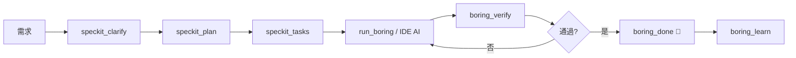

[](https://www.python.org/downloads/)
[](https://github.com/Boring206/boring-gemini)

# Boring for Gemini (V5.2)

> **企業級自主 AI 開發代理 (Autonomous Developer)**  
> 專為 Cursor / Claude Desktop / VS Code 打造，利用 Google Gemini 模型驅動的自動化編碼與驗證引擎。
>
> ✅ **Verified Platforms**: Gemini CLI • Antigravity • Cursor

---

## 🚀 核心優勢 (Why Boring?)

- **🤖 Autonomous & Architect Mode**: 既能自動寫全套程式 (Standalone)，也能作為架構師 (Architect) 指揮您的 IDE AI 協同工作。
- **🔌 Full MCP Support**: 完美整合 Protocol，支援 `context7` (查文件)、`notebooklm` (查知識庫) 與 `criticalthink` (深度思考)。
- **🛡️ 企業級防護**: 內建斷路器 (Circuit Breaker)、自動修復 (Self-Healing) 與 100% 測試覆蓋率。
- **🧩 Spec-Driven Development**: 整合 SpecKit，從 PRD 到 Code 實現 100% 規格一致性。

---

## 📦 安裝指南 (Installation)

請選擇適合您的方式：

### 推薦方式：Smithery (一鍵部署，免 Python 環境)(目前失敗註冊smithery不知道爲什麼所以這是未來期許.....)

最適合 **Cursor** 或 **Claude Desktop** 使用者。

1.  **安裝本體**:
    ```bash
    npx @smithery/cli install boring-gemini
    ```

2.  **配置配套服務 (⚠️ 重要 / Required)**:
    Boring 的部分核心功能依賴外部 MCP Server。請務必在您的 IDE 設定檔 (`claude_desktop_config.json` 或 Cursor 設定) 中加入以下**完整配置**：

    ```json
    {
      "mcpServers": {
        "boring": {
          "command": "npx",
          "args": ["-y", "@smithery/cli", "run", "boring-gemini", "--config", "{}"]
        },
        "context7": {
          "command": "npx",
          "args": ["-y", "@upstash/context7-mcp"]
        },
        "criticalthink": {
          "command": "npx",
          "args": ["-y", "@modelcontextprotocol/server-sequential-thinking"]
        },
        "notebooklm": {
          "command": "npx",
          "args": ["-y", "notebooklm-mcp@latest"]
        }
      }
    }
    ```
    > **注意**: `notebooklm` 需要登入，初次使用請執行 `npx -y notebooklm-mcp@latest setup_auth` 完成 Google 認證。

### 開發者方式：Python Source (適合貢獻代碼)

```bash
# Clone & Install
git clone https://github.com/Boring206/boring-gemini.git
cd boring-gemini
pip install -e ".[all,dev]"

# 安裝擴展
boring setup-extensions
```

---

## 🛠️ 功能與指令 (Features & Usage)

安裝完成後，您可以在 Chat 中直接與 AI 互動，或使用以下工具：

### 1. 核心工具 (Agent Tools)

| 工具名稱 | 用途 |
| :--- | :--- |
| **`run_boring`** | **主要入口**。給它一個任務描述，它會自動規劃並執行。 |
| **`boring_quickstart`** | 🆕 **新手引導**。取得推薦步驟和可用工具清單。 |
| **`boring_verify`** | 執行全專案檢查 (Lint, Test, Import)。 |
| **`boring_health_check`** | 檢查系統健康狀態。 |
| **`boring_done`** | 🔔 完成通知。Agent 完成任務時呼叫，會發送 **Windows 桌面通知**。 |
| **`boring_learn`** | 🆕 從 `.boring_memory` 提取學習模式到 `.boring_brain`。 |
| **`boring_create_rubrics`** | 🆕 創建評估標準 (LLM-as-Judge)。 |
| **`boring_brain_summary`** | 🆕 查看知識庫摘要。 |

### 2. SpecKit 工作流 (Spec-Driven)

| 工具名稱 | 用途 |
| :--- | :--- |
| **`speckit_plan`** | 根據 PRD 生成 `IMPLEMENTATION_PLAN.md`。 |
| **`speckit_tasks`** | 將計畫拆解為 `task.md`。 |
| **`speckit_analyze`** | 比對 Code 與 Spec 的一致性 (Consistency Check)。 |
| **`speckit_constitution`** | 建立專案核心原則與開發準則。 |
| **`speckit_clarify`** | AI 反問模式，釐清模糊需求。 |
| **`speckit_checklist`** | 生成品質驗證檢查清單。 |

### 2.1 動態工作流程演化 (Workflow Evolution) 🆕

AI 可根據專案需求**動態修改** SpecKit 工作流程：

| 工具名稱 | 用途 |
| :--- | :--- |
| **`speckit_evolve_workflow`** | 修改工作流程內容以適應專案。 |
| **`speckit_reset_workflow`** | 回滾到原始模板。 |
| **`speckit_backup_workflows`** | 備份所有工作流程到 `_base/`。 |
| **`speckit_workflow_status`** | 查看工作流程演化狀態。 |

### 3. 微操作 (Granular Tools)

| 工具名稱 | 用途 |
| :--- | :--- |
| **`boring_apply_patch`** | 精確修改檔案 (Search/Replace)，不破壞其他部分。 |
| **`boring_verify_file`** | 單檔快速驗證。 |
| **`boring_extract_patches`** | 從 AI 輸出中萃取並套用程式碼修改 (支援多種格式)。 |

---

## 💡 使用範例

### 快速開始
```
你: 請幫我建立一個 TypeScript API 專案的規劃
AI: (呼叫 speckit_plan) 生成 implementation_plan.md...
```

### 動態演化工作流程
```
你: 這個專案需要特別強調安全測試，請調整 speckit-checklist 工作流程
AI: (呼叫 speckit_evolve_workflow) 已修改 speckit-checklist.md，
    添加了 OWASP Top 10 安全檢查項目...
```

### 使用記憶系統
```
你: 上次解決類似問題的方式是什麼？
AI: (查詢 .boring_memory) 找到 3 個相關經驗，建議使用...
```

---

## 📋 開發 Prompt 範本 (Copy & Paste)

> 複製以下 Prompt 直接貼上聊天，快速啟動開發！

### 🆕 新專案啟動

```
請使用 Boring MCP 幫我規劃一個新專案：

專案名稱：[你的專案名稱]
技術棧：[例如：Next.js 14 + TypeScript + Prisma + PostgreSQL]
核心功能：
1. [功能一]
2. [功能二]
3. [功能三]

請依序執行：
1. speckit_plan - 產出實作計劃
2. speckit_tasks - 拆解為任務清單
3. 等我確認後開始實作
```

### 🔧 重構現有程式碼

```
請使用 Boring MCP 重構以下程式碼：

目標檔案：[路徑]
重構目標：
- [ ] 提升可讀性
- [ ] 拆分過長函數
- [ ] 加入錯誤處理
- [ ] 補充 TypeScript 型別

請先執行 boring_verify 檢查現況，
再用 boring_apply_patch 逐步修改。
```

### 🐛 Debug 流程

```
我遇到了一個問題：

錯誤訊息：[貼上錯誤訊息]
發生位置：[檔案路徑和行數]
預期行為：[應該發生什麼]
實際行為：[實際發生什麼]

請使用 criticalthink 分析問題根因，
然後用 boring_apply_patch 修復。
```

### 📚 學習新技術

```
我想在這個專案中使用 [技術名稱，例如：Zustand 狀態管理]

請幫我：
1. 使用 context7 查詢最新文件
2. 用 speckit_plan 規劃整合方案
3. 產出具體的實作步驟
```

### 🧪 補充測試

```
請幫我補充測試：

目標檔案：[路徑]
測試框架：[例如：Vitest / Jest / Pytest]
需要覆蓋：
- [ ] Happy path
- [ ] Edge cases
- [ ] Error handling

先用 boring_verify 檢查現有覆蓋率，
再產出測試程式碼。
```

### 🏗️ 全自動開發模式

```
請使用 run_boring 自動完成以下任務：

任務描述：[詳細描述你要做的事]
驗證級別：STANDARD
完成後請發送 boring_done 通知我。
```

### 🔍 程式碼審查

```
請審查以下程式碼的品質：

目標檔案：[路徑或貼上程式碼]

請使用 boring_verify SEMANTIC 進行評估，
並根據以下 Rubrics 給出建議：
- code_quality
- security  
- architecture
```

### 📝 API 設計

```
請幫我設計 RESTful API：

資源名稱：[例如：User, Product, Order]
需要的端點：
- GET /[resource] - 列表
- POST /[resource] - 新增
- GET /[resource]/:id - 單筆
- PUT /[resource]/:id - 更新
- DELETE /[resource]/:id - 刪除

請用 speckit_plan 產出 API 規格，
包含 Request/Response Schema。
```

---

## 🔌 各 MCP Server 專用 Prompt

> 學會對每個 MCP 下正確的指令，讓 AI 發揮最大效能！

### 🤖 Boring MCP (自主開發代理) — 完整 Prompt 指南

**核心用法**：Boring 是主力開發工具，負責規劃、執行、驗證。

#### 📋 SpecKit 工作流工具

```
# speckit_plan — 規劃專案
"使用 speckit_plan 規劃一個 Next.js 14 電商網站，包含購物車、結帳、會員系統"
"使用 speckit_plan 規劃重構 legacy PHP 系統到 Node.js 的遷移方案"

# speckit_tasks — 拆解任務
"使用 speckit_tasks 將 implementation_plan.md 拆解為可執行的任務清單"
"使用 speckit_tasks 產出任務，每個任務要包含驗證標準"

# speckit_analyze — 一致性檢查
"使用 speckit_analyze 檢查目前程式碼是否符合 spec.md 規格"
"使用 speckit_analyze 找出 implementation_plan.md 和實際程式碼的差距"

# speckit_clarify — 釐清需求
"使用 speckit_clarify 分析這個需求的模糊之處，提出澄清問題"
"這個 PRD 還不夠清楚，用 speckit_clarify 問我問題"

# speckit_constitution — 建立準則
"使用 speckit_constitution 建立這個專案的開發準則和品質標準"

# speckit_checklist — 產出檢查表
"使用 speckit_checklist 產出上線前的品質檢查清單"
```

#### 🔄 動態工作流程演化

```
# speckit_evolve_workflow — 修改工作流程
"使用 speckit_evolve_workflow 修改 speckit-plan，
 加入 API 文件規範：每個 endpoint 必須定義 Request/Response Schema"

"使用 speckit_evolve_workflow 修改 speckit-checklist，
 加入 OWASP Top 10 安全檢查項目"

# speckit_reset_workflow — 回滾
"使用 speckit_reset_workflow 將 speckit-plan 還原為預設版本"

# speckit_backup_workflows — 備份
"使用 speckit_backup_workflows 備份所有工作流程"

# speckit_workflow_status — 查看狀態
"使用 speckit_workflow_status 查看 speckit-plan 的演化歷史"
```

#### 🚀 核心執行工具

```
# run_boring — 自動開發 (最強指令)
"使用 run_boring 自動完成：建立 Express.js REST API with TypeScript"
"使用 run_boring 完成 task.md 中的第一個任務"
"使用 run_boring 實作登入功能，使用 JWT + bcrypt"

# boring_verify — 專案驗證
"使用 boring_verify BASIC 快速檢查語法錯誤"
"使用 boring_verify STANDARD 執行 Lint + 測試"
"使用 boring_verify FULL 完整驗證包含 import 檢查"
"使用 boring_verify SEMANTIC 用 LLM 評估程式碼品質"

# boring_verify_file — 單檔驗證
"使用 boring_verify_file 快速驗證 src/utils/auth.ts"
```

#### ✏️ 程式碼修改工具

```
# boring_apply_patch — 精確修改
"使用 boring_apply_patch 將 src/api/users.ts 中的
 'const users = []' 改成 'const users: User[] = []'"

"使用 boring_apply_patch 修改 src/config.ts，
 將 API_URL 從 localhost 改成環境變數"

# boring_extract_patches — 萃取並套用
"使用 boring_extract_patches 從上面的程式碼區塊萃取修改並套用"
```

#### 🧠 學習與知識管理

```
# boring_learn — 提取學習模式
"使用 boring_learn 從 .boring_memory 提取成功解決問題的模式"

# boring_create_rubrics — 建立評估標準
"使用 boring_create_rubrics 建立預設評估標準"

# boring_brain_summary — 查看知識庫
"使用 boring_brain_summary 查看目前學到了什麼模式"
```

#### 🔧 系統工具

```
# boring_health_check — 健康檢查
"使用 boring_health_check 確認系統是否正常"

# boring_quickstart — 新手引導
"使用 boring_quickstart 獲取使用指南"

# boring_status — 專案狀態
"使用 boring_status 查看目前專案的 Boring 狀態"

# boring_done — 完成通知
"任務完成後使用 boring_done 發送桌面通知"

# boring_list_workflows — 列出工作流程
"使用 boring_list_workflows 查看所有可用的工作流程"
```

---

### 📚 Context7 MCP (即時文件查詢)

**核心用法**：查詢最新的程式庫文件，不依賴過時的訓練資料。

```
# 基本查詢
"使用 context7 查詢 React 19 的 use() hook 用法"

# 特定版本
"使用 context7 查詢 Next.js 14 的 Server Actions 範例"

# 比較差異
"使用 context7 查詢 Prisma 5 和 Prisma 4 的差異"

# 遷移指南
"使用 context7 查詢 Vue 2 to Vue 3 migration guide"

# 最佳實踐
"使用 context7 查詢 TypeScript 5 的最佳實踐"

# 錯誤解決
"使用 context7 查詢 Next.js 的 'Cannot read properties of null' 解法"
```

---

### 🧠 CriticalThink MCP (深度邏輯分析)

**核心用法**：處理複雜問題，需要多步推理，避免 AI 胡說八道。

```
# 分析問題
"使用 criticalthink 分析這個 Bug 的根本原因：[錯誤描述]"

# 設計決策
"使用 criticalthink 比較 Redux vs Zustand vs Jotai，
 考慮我的專案規模是 [大/中/小]，團隊人數 [N] 人"

# 架構設計
"使用 criticalthink 分析這個微服務架構的優缺點：
 [貼上架構圖或描述]"

# 效能瓶頸
"使用 criticalthink 逐步分析這個 SQL 查詢為什麼慢：
 [貼上 SQL]"

# 重構策略
"使用 criticalthink 分析這個 legacy code 的重構策略，
 風險評估和執行順序"

# 技術選型
"使用 criticalthink 分析 PostgreSQL vs MongoDB 對於 [使用場景] 的適合度"
```

---

### 📔 NotebookLM MCP (專案知識庫)

**核心用法**：查詢你上傳到 NotebookLM 的專案文件、規格書、會議紀錄。

```
# 查詢知識庫
"使用 notebooklm 查詢我們的 API 規格中，User 欄位有哪些"

# 對照規格
"使用 notebooklm 確認這個實作是否符合 PRD 需求"

# 查詢歷史
"使用 notebooklm 查詢上次會議決定的技術選型"

# 尋找定義  
"使用 notebooklm 查詢 '高優先' 的定義是什麼"

# 驗證一致性
"使用 notebooklm 確認 implementation_plan.md 與 PRD 是否一致"

# 設定知識庫
"使用 notebooklm add_notebook 添加這個 URL：[NotebookLM 分享連結]"
```

---

### 🔗 MCP 組合技 (殺手級用法)

**最強工作流程**：組合多個 MCP 達成複雜任務！

```
# 技術研究 + 實作
"先用 context7 查詢 Stripe API 的 Webhook 處理方式，
 再用 speckit_plan 規劃付款系統實作"

# 深度分析 + 自動修復
"先用 criticalthink 分析這個 race condition 問題，
 再用 boring_apply_patch 實作修復"

# 知識庫 + 一致性檢查
"先用 notebooklm 查詢 PRD 需求，
 再用 speckit_analyze 檢查程式碼是否符合規格"

# 全流程自動化
"先用 context7 查詢 [技術] 最佳實踐，
 用 criticalthink 設計架構，
 用 speckit_plan 產出計劃，
 用 speckit_tasks 拆解任務，
 用 run_boring 自動執行，
 最後用 boring_done 通知我"
```

---

## 🌍 Gemini CLI 整合

如果您偏好在終端機使用 Gemini CLI，可以將 Smithery 版 Boring 註冊進去：

```bash
gemini mcp add boring npx -- -y @smithery/cli run boring-gemini
```
註冊後即可在終端機對話：「請用 boring 幫我重構這個資料夾...」。

---

## 🧠 進階使用技巧：讓 AI Coding 進化 (Pro Tips)

> **核心哲學**: Boring 不只是工具，它是你的 **AI 開發副駕駛**。正確使用它，可以讓你的編碼效率提升 10 倍。

### 🎯 Tip 1: 三階段工作法 (Plan → Task → Execute)

不要直接讓 AI 寫程式碼！使用 **SpecKit 流程** 確保品質：

```
Step 1: speckit_plan → 產出 implementation_plan.md
Step 2: speckit_tasks → 拆解為可追蹤的 task.md
Step 3: run_boring 或讓 IDE AI 依任務執行
```

**為什麼這樣做？** 先規劃再執行，AI 不會亂寫、不會遺漏、不會重複。

---

### 🔄 Tip 2: 動態演化工作流程 (Workflow Evolution)

每個專案都不同！使用 `speckit_evolve_workflow` 讓工作流程適應你的專案：

```
# React 專案？加入 Component 結構檢查
speckit_evolve_workflow("speckit-checklist", "新內容...", "優化 React 專案")

# 高安全需求？強化安全檢查項目
speckit_evolve_workflow("speckit-analyze", "新內容...", "加入 OWASP Top 10")
```

> 💡 **Pro Move**: 完美的工作流程會儲存在 `.boring_brain/workflow_adaptations/`，下次專案可以復用！

---

### 🧬 Tip 3: 建立專案記憶 (Memory System)

Boring 會學習！每次成功修復錯誤都會記錄：

```
1. 開發時：AI 遇到錯誤 → 自動記錄到 .boring_memory
2. 累積後：執行 boring_learn → 提取模式到 .boring_brain
3. 未來：AI 遇到類似問題 → 自動套用學過的解法
```

> 💡 **Pro Move**: 在複雜專案結束後執行 `boring_learn`，讓 AI 變得更聰明！

---

### 🛡️ Tip 4: 使用 LLM-as-Judge 評估品質

不要盲目信任 AI 輸出！使用 **Rubrics** 進行品質評估：

```
1. boring_create_rubrics  → 創建評估標準
2. boring_verify SEMANTIC → 使用 LLM 評估程式碼品質
```

**預設 Rubrics** (8 種):
- `code_quality` - 可讀性、文件、模組化
- `security` - 密鑰洩露、注入攻擊
- `architecture` - 依賴流向、可擴展性
- `testing` - 覆蓋率、隔離性
- `documentation` - 完整性、準確性
- `implementation_plan` - 可行性、風險評估
- `api_design` - 一致性、錯誤回應
- `performance` - 演算法效率、資源使用

---

### 🔧 Tip 5: 最佳 MCP 配置組合

這是久經驗證的頂級配置：

| MCP Server | 用途 |
|------------|------|
| **boring** | 🤖 自主開發代理（主力） |
| **context7** | 📚 查詢最新文件（必備） |
| **criticalthink** | 🧠 深度邏輯分析（複雜問題必用） |
| **notebooklm** | 📔 專案知識庫查詢（企業級） |

**進階技巧**: 在處理複雜問題時，先用 `criticalthink` 分析問題結構，再讓 `boring` 執行！

---

### 🚀 Tip 6: 高效互動模式

**直接下指令 (最佳實踐)**:
```
❌ 錯誤: "幫我寫個 API"
✅ 正確: "使用 speckit_plan 規劃一個 Express.js REST API，
         包含 User CRUD、JWT 驗證、MongoDB 連接"
```

**讓 AI 發問 (處理模糊需求)**:
```
你: 這個專案的需求還不太清楚
AI: (呼叫 speckit_clarify) 讓我問幾個問題...
   1. 使用者認證方式？
   2. 資料儲存需求？
   3. 預期用戶量？
```

---

### 📈 Tip 7: 完整開發週期



---

## 常見問題 (Troubleshooting)

1.  **`context7` 相關錯誤**:
    請確認您已正確複製上方的完整 JSON 配置，`context7` 是必備組件。

2.  **Interactive Mode (卡住/沒反應)**:
    當在 IDE 中使用時，Boring 預設為 **Architect Mode**。它會生成計畫與指令，然後**停下來**等您 (或 IDE 的 AI) 去執行寫入操作。這是正常且安全的設計。

3.  **NotebookLM 無法連接**:
    請務必執行 `setup_auth` 進行瀏覽器登入。

---

## 📁 專案結構

```text
my-project/
├── .boring_memory/      # 錯誤學習資料庫 (SQLite)
├── .boring_brain/       # 🆕 知識庫 (演化記錄、學習模式)
│   ├── workflow_adaptations/
│   ├── learned_patterns/
│   └── rubrics/
├── .agent/workflows/    # SpecKit 工作流程
│   ├── _base/          # 基礎模板備份
│   └── *.md            # 可演化的活動版本
├── PROMPT.md           # 專案核心指令
├── @fix_plan.md        # 任務進度表
├── src/                # 您的源碼
└── logs/               # JSON 結構化日誌
```

---

**Boring V5.2 - Making AI Development Boringly Reliable.**
