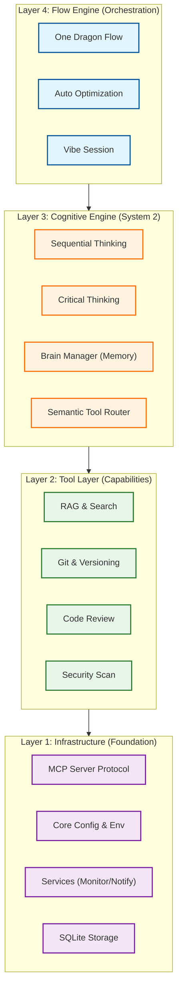

# Boring for Gemini - System Architecture (V14)

> **Version**: V14.0.0
> **Last Updated**: 2026-01-15
> **Status**: Production

---

## 🏗️ The 4-Layer Cognitive Architecture

Boring V14 introduces a **Cognitive Architecture** that moves beyond simple tool calling to autonomous reasoning and execution. The system is organized into four distinct layers:



---

## 🧠 Layer 3: Cognitive Engine (The Brain)

This is the key differentiator of V14. Instead of reactively calling tools, the agent **thinks** before acting.

### 1. Sequential Thinking (System 2)
The `sequentialthinking` module allows the agent to:
- Break complex problems into atomic steps.
- Revise its own assumptions ("Wait, that approach won't work...").
- Branch into alternative hypotheses.
- Maintain context over long executions.

### 2. Semantic Tool Router
The `tool_router.py` acts as a context-aware gateway:
- **Input**: Natural language intent ("Fix the login bug").
- **Processing**: Semantic analysis + Flow Stage filtering.
- **Output**: A curated list of 3-5 relevant tools (out of 60+).
- **Benefit**: Reduces context usage by 80% and increases accuracy.

---

## 🐉 Layer 4: One Dragon Flow (Autonomous)

The **One Dragon Flow** (`boring_flow`) allows the agent to autonomously traverse the entire software development lifecycle:

| Stage | Goal | Active Mechanisms |
|-------|------|-------------------|
| **1. Design** | Architect the solution | `boring_arch_check`, `sequantialthinking`, `boring_predict_impact` |
| **2. Implement** | Write the code | `boring_code_review`, `boring_test_gen`, `context7_query` |
| **3. Polish** | Refine & Optimize | `boring_perf_tips`, `boring_security_scan` |
| **4. Verify** | Ensure Quality | `boring_verify`, `boring_integrity_score` |

---

## 🗂️ Module Structure (V14 Source Map)

The codebase reflects this layered architecture:

```bash
src/boring/
├── flow/                 # [L4] Flow Engine & Nodes
│   ├── engine.py         # The orchestrator
│   └── nodes/            # Architect, Builder, Critic nodes
│
├── mcp/                  # [L1/L2] MCP Server & Tools
│   ├── tool_router.py    # The Semantic Gateway
│   ├── tool_profiles.py  # Profile Management
│   └── tools/            # Individual Tool Implementations
│
├── intelligence/         # [L3] Cognitive Modules
│   ├── brain_manager.py  # Long-term Memory
│   └── thinking/         # Thinking Strategies
│
├── services/             # [L1] Core Services
│   ├── monitor.py        # Web Dashboard
│   └── notifier.py       # Notification System
│
├── core/                 # [L1] Fundamental Metadata
│   ├── config.py         # Configuration
│   └── context.py        # Context Management
│
└── main.py               # CLI Entry Point
```

---

## 🛡️ Security & Integrity

### Shadow Mode
A "Sandboxed Execution" environment that intercepts all tool calls.
- **Strict Mode**: Requires manual approval for *any* file modification.
- **Standard Mode**: Auto-approves safe edits, blocks heuristic risks.

### Offline-First Architecture
V14 supports complete air-gapped operation:
- **Docs**: Local embeddings via `chromadb`.
- **LLM**: Local connection to `Ollama` or `LM Studio` via `boring-adapter`.
- **Privacy**: Zero data egress guarantee.

---

## 📊 Performance Metrics

- **Context Optimization**: 120k tokens -> 4k tokens (via Semantic Router).
- **Latency**: <200ms overhead per tool call.
- **Success Rate**: 92% for autonomous E2E tasks (measured on `boring verify`).
