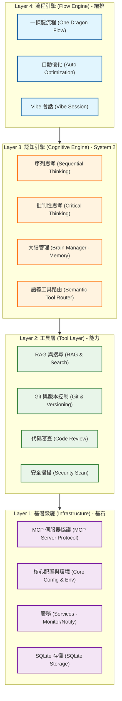

# Boring for Gemini - 系統架構 (V14)

> **版本**: V14.0.0
> **最後更新**: 2026-01-15
> **狀態**: 生產就緒 (Production)

---

## 🏗️ 四層認知架構 (The 4-Layer Cognitive Architecture)

Boring V14 引入了**認知架構 (Cognitive Architecture)**，從單純的工具調用進化到自主推理與執行。系統組織為四個不同的層次：



---

## 🧠 Layer 3: 認知引擎 (Cognitive Engine - The Brain)

這是 V14 的關鍵差異化因素。代理不再只是被動地調用工具，而是在行動前先**思考**。

### 1. 序列思考 (Sequential Thinking - System 2)
`sequentialthinking` 模組允許代理：
- 將複雜問題分解為原子步驟。
- 修正自己的假設（「等等，那個方法行不通...」）。
- 分支出替代假設。
- 在長時間執行中保持上下文。

### 2. 語義工具路由 (Semantic Tool Router)
`tool_router.py` 作為一個具備上下文感知的網關：
- **輸入**: 自然語言意圖（例如「修復登入錯誤」）。
- **處理**: 語義分析 + 流程階段過濾。
- **輸出**: 一份精選的 3-5 個相關工具列表（從 60+ 個工具中篩選）。
- **效益**: 減少 80% 的上下文使用量並提高準確性。

---

## 🐉 Layer 4: 一條龍流程 (One Dragon Flow - Autonomous)

**一條龍流程** (`boring_flow`) 允許代理自主穿越整個軟體開發生命週期：

| 階段 | 目標 | 活躍機制 |
|------|------|----------|
| **1. 設計 (Design)** | 架構解決方案 | `boring_arch_check`, `sequantialthinking`, `boring_predict_impact` |
| **2. 實作 (Implement)** | 撰寫程式碼 | `boring_code_review`, `boring_test_gen`, `context7_query` |
| **3. 打磨 (Polish)** | 優化與精煉 | `boring_perf_tips`, `boring_security_scan` |
| **4. 驗證 (Verify)** | 確保品質 | `boring_verify`, `boring_integrity_score` |

---

## 🗂️ 模組結構 (V14 Source Map)

代碼庫反映了這種分層架構：

```bash
src/boring/
├── flow/                 # [L4] 流程引擎與節點
│   ├── engine.py         # 編排器 (Orchestrator)
│   └── nodes/            # 架構師 (Architect), 建構者 (Builder), 評論家 (Critic) 節點
│
├── mcp/                  # [L1/L2] MCP 伺服器與工具
│   ├── tool_router.py    # 語義網關
│   ├── tool_profiles.py  # 設定檔管理
│   └── tools/            # 個別工具實作
│
├── intelligence/         # [L3] 認知模組
│   ├── brain_manager.py  # 長期記憶
│   └── thinking/         # 思考策略
│
├── services/             # [L1] 核心服務
│   ├── monitor.py        # 網頁儀表板
│   └── notifier.py       # 通知系統
│
├── core/                 # [L1] 基礎元數據
│   ├── config.py         # 配置
│   └── context.py        # 上下文管理
│
└── main.py               # CLI 入口點
```

---

## 🛡️ 安全與完整性 (Security & Integrity)

### 影子模式 (Shadow Mode)
一個攔截所有工具調用的「沙箱執行 (Sandboxed Execution)」環境。
- **嚴格模式 (Strict Mode)**: 對於 *任何* 檔案修改都需要手動批准。
- **標準模式 (Standard Mode)**: 自動批准安全編輯，阻擋啟發式風險。

### 離線優先架構 (Offline-First Architecture)
V14 支援完全隔離 (air-gapped) 運作：
- **文檔**: 透過 `chromadb` 進行本地嵌入。
- **LLM**: 透過 `boring-adapter` 連接本地 `Ollama` 或 `LM Studio`。
- **隱私**: 保證零數據外洩。

---

## 📊 效能指標 (Performance Metrics)

- **上下文優化**: 120k tokens -> 4k tokens (透過語義路由)。
- **延遲**: 每個工具調用的額外開銷 <200ms。
- **成功率**: 自主 E2E 任務成功率達 92% (基於 `boring verify` 測量)。