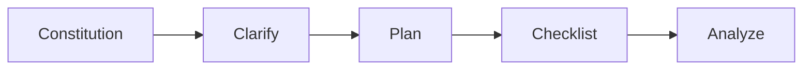

# MCP Toolset Reference

> Boring provides 55+ MCP tools organized into logical categories.
>
> **✨ Vibe Coder Tip**: You usually don't need to call these tools directly. Use the **[Universal Router](./vibe-coder.md)** (`boring()`) instead.

---

## 🔎 Dynamic Discovery

### For AI Clients

AI assistants can discover tools dynamically without loading all definitions:

```
# Read capability resource
boring://capabilities

# Read specific category tools
boring://tools/security
boring://tools/verification
boring://tools/agents
```

---

## 🧰 Core Tool Categories

### 1. Security (`boring_security_scan`)

Multi-layered security scanning with SAST, secret detection, and dependency audits.

```python
boring_security_scan(
    project_path=".",
    scan_type="all",        # all|sast|secrets|dependencies
    fix_mode=False          # Auto-fix when possible
)
```

**Supported File Types**: Python, JavaScript, TypeScript, Go, Rust, Java, C/C++, YAML, JSON, Docker, Terraform

---

### 2. Transactions (`boring_transaction`)

Atomic Git operations with automatic rollback on failure.

```python
# Start transaction
boring_transaction(action="start", name="feature-auth")

# Work on changes...

# Commit or rollback
boring_transaction(action="commit", message="Add auth")
boring_transaction(action="rollback")
```

---

### 3. Background Tasks (`boring_task`)

Run long-running operations asynchronously.

```python
# Start background task
task_id = boring_task(
    action="start",
    task_type="verify",     # verify|test|lint|custom
    command="pytest -v"
)

# Check status
boring_task(action="status", task_id=task_id)

# Get logs
boring_task(action="logs", task_id=task_id)
```

---

### 4. Context Memory (`boring_context`)

Cross-session project memory persistence.

```python
# Save context
boring_context(action="save", key="architecture", value="microservices")

# Load context
result = boring_context(action="load", key="architecture")

# List all contexts
boring_context(action="list")
```

---

### 5. Verification (`boring_verify`)

Multi-level code verification from quick syntax checks to full testing.

| Level | Checks | Speed |
|-------|--------|-------|
| `BASIC` | Syntax only | ~2s |
| `STANDARD` | Syntax + Lint | ~10s |
| `FULL` | All + Tests | ~60s |
| `SEMANTIC` | + AI Review | ~120s |

```python
boring_verify(
    project_path=".",
    level="STANDARD",
    incremental=True        # Only changed files
)
```

---

### 6. RAG Memory (`boring_rag_search`)

Semantic code search with hybrid Vector + Keyword matching.

```python
boring_rag_search(
    query="authentication middleware",
    project_path=".",
    top_k=10,
    expand_deps=True        # Include dependencies
)
```

> **Note**: RAG features require local installation with `pip install "boring-aicoding[mcp]"`. Not available in Smithery cloud deployment.

---

### 7. Multi-Agent (`boring_multi_agent`)

Orchestrate complex workflows with specialized agents.

```python
# Get workflow prompt (default)
boring_multi_agent(
    workflow="plan_and_implement",
    context={"feature": "user authentication"}
)

# Execute in background
boring_multi_agent(
    workflow="plan_and_implement",
    context={"feature": "user authentication"},
    execute=True
)
```

**Available Workflows**:
- `plan_and_implement` - End-to-end development
- `review_and_fix` - Code review with fixes
- `debug_and_test` - Debugging with test generation

---

### 8. Shadow Mode (`boring_shadow_mode`)

Security sandbox for high-risk operations.

```python
# Check status
boring_shadow_mode(action="status")

# Change mode
boring_shadow_mode(
    action="set_level",
    level="STRICT"          # DISABLED|ENABLED|STRICT
)

# Approve pending operation
boring_shadow_mode(action="approve", operation_id="op_123")
```

See [Shadow Mode](./shadow-mode.md) for detailed documentation.

---

### 9. Git (`boring_commit`)

Smart commit message generation from task context.

```python
boring_commit(
    project_path=".",
    scope="feat",           # feat|fix|docs|refactor|test
    auto_stage=True
)
```

---

### 10. Workspace (`boring_workspace_switch`)

Multi-project workspace management.

```python
# Switch workspace
boring_workspace_switch(path="/path/to/project")

# List workspaces
boring_workspace_switch(action="list")
```

---

### 11. Knowledge (`boring_learn`)

Extract and store project patterns.

```python
# Learn from current session
boring_learn(
    project_path=".",
    topics=["error-handling", "testing"]
)
```

---

### 12. Evaluation (`boring_evaluate`)

LLM-as-Judge code scoring.

```python
boring_evaluate(
    target="src/main.py",
    level="DIRECT",         # DIRECT|PAIRWISE|RUBRIC
    criteria=["correctness", "readability"]
)
```

---

## 🚀 Quick Start Prompts

One-click workflows for common tasks:

| Prompt | Usage |
|--------|-------|
| `vibe_start` | `/vibe_start Build a FastAPI auth service` |
| `quick_fix` | `/quick_fix` |
| `full_stack_dev` | `/full_stack_dev my-app "Next.js + FastAPI"` |
| `smart_commit` | `/smart_commit` |

---

## 📋 SpecKit Workflow

Specification-driven development in 5 steps:



| Step | Tool | Purpose |
|------|------|---------|
| 1 | `speckit_constitution` | Establish principles |
| 2 | `speckit_clarify` | Clarify requirements |
| 3 | `speckit_plan` | Create implementation plan |
| 4 | `speckit_checklist` | Build acceptance criteria |
| 5 | `speckit_analyze` | Lint (100 files) | ~15s | < 2s |

### Context Optimization (Tool Profiles)

Boring V10.24 introduces **Tool Profiles** to reduce LLM context usage:

| Profile | Tools | Context Usage | Best For |
|---------|-------|---------------|----------|
| `minimal` | 8 | ~2k tokens | Chat / Q&A |
| `lite` | 20 | ~5k tokens | **Default** / General Dev |
| `standard` | 50 | ~15k tokens | Complex Refactoring |
| `full` | 98+ | ~30k tokens | Admin / Deep Debug |

Enable via `.boring.toml` or env `BORING_MCP_PROFILE=lite`.


## See Also

- [Shadow Mode](./shadow-mode.md) - Security details
- [Quality Gates](./quality-gates.md) - CI/CD integration
- [Tool Reference (Appendix A)](../APPENDIX_A_TOOL_REFERENCE.md) - Complete API reference
