# MCP 工具集參考

> Boring 提供 55+ 個 MCP 工具，按邏輯分類組織。
>
> **✨ Vibe Coder 提示**: 你通常不需要直接呼叫這些工具。請使用 **[通用路由器 (Universal Router)](./vibe-coder_zh.md)** (`boring()`)。

---

## 🔎 動態發現

### AI 客戶端用

AI 助手可以動態發現工具，無需載入所有定義：

```
# 讀取能力資源
boring://capabilities

# 讀取特定類別工具
boring://tools/security
boring://tools/verification
boring://tools/agents
```

---

### 0. 技能生態系 (Skills Ecosystem)

#### 技能發現 (`boring_skills_browse`)

互動式瀏覽社群 Skills 和 Extensions。

```python
boring_skills_browse(query="web")
# 回傳結果會包含安裝建議
```

#### 技能安裝 (`boring_skills_install`)

一鍵安裝指定的 Skill (基於 `skills_catalog.py` 的白名單)。

```python
boring_skills_install(name="awesome-gemini-cli-extensions")
```

---

## 🧰 核心工具類別

### 0. 技能發現 (`boring_skills_browse`)

互動式瀏覽並發現由社群維護的 Gemini/Claude Skills 與 MCP Servers。

```python
boring_skills_browse(
    query="web automation",   # 關鍵字：'web', 'database', 'auth'
    platform="all"            # all|gemini|claude
)
```

**用途**：
- 尋找適合當前任務的擴充工具
- 發現最新的 MCP Servers
- 獲取安裝指引

---

### 1. 安全掃描 (`boring_security_scan`)

多層安全掃描，包括 SAST、密鑰偵測和依賴審計。

```python
boring_security_scan(
    project_path=".",
    scan_type="all",        # all|sast|secrets|dependencies
    fix_mode=False          # 可能時自動修復
)
```

**支援的檔案類型**：Python、JavaScript、TypeScript、Go、Rust、Java、C/C++、YAML、JSON、Docker、Terraform

---

### 2. 交易 (`boring_transaction`)

具有自動回滾的原子 Git 操作。

```python
# 開始交易
boring_transaction(action="start", name="feature-auth")

# 進行變更...

# 提交或回滾
boring_transaction(action="commit", message="Add auth")
boring_transaction(action="rollback")
```

---

### 3. 背景任務 (`boring_task`)

非同步執行長時間運行的操作。

```python
# 啟動背景任務
task_id = boring_task(
    action="start",
    task_type="verify",     # verify|test|lint|custom
    command="pytest -v"
)

# 檢查狀態
boring_task(action="status", task_id=task_id)

# 取得日誌
boring_task(action="logs", task_id=task_id)
```

---

### 4. 上下文記憶 (`boring_context`)

跨會話專案記憶持久化。

```python
# 儲存上下文
boring_context(action="save", key="architecture", value="microservices")

# 載入上下文
result = boring_context(action="load", key="architecture")

# 列出所有上下文
boring_context(action="list")
```

---

### 5. 驗證 (`boring_verify`)

從快速語法檢查到完整測試的多級代碼驗證。

| 級別 | 檢查內容 | 速度 |
|------|----------|------|
| `BASIC` | 僅語法 | ~2秒 |
| `STANDARD` | 語法 + Lint | ~10秒 |
| `FULL` | 全部 + 測試 | ~60秒 |
| `SEMANTIC` | + AI 審查 | ~120秒 |

```python
boring_verify(
    project_path=".",
    level="STANDARD",
    incremental=True        # 僅變更的檔案
)
```

---

### 6. RAG 記憶 (`boring_rag_search`)

具有混合向量 + 關鍵字匹配的語意代碼搜尋。

```python
boring_rag_search(
    query="authentication middleware",
    project_path=".",
    top_k=10,
    expand_deps=True        # 包含依賴
)
```

> **注意**：RAG 功能需要使用 `pip install "boring-aicoding[mcp]"` 本地安裝。Smithery 雲端部署不可用。

---

### 7. 多代理 (`boring_multi_agent`)

使用專門代理協調複雜工作流程。

```python
# 取得工作流程提示（預設）
boring_multi_agent(
    workflow="plan_and_implement",
    context={"feature": "user authentication"}
)

# 在背景執行
boring_multi_agent(
    workflow="plan_and_implement",
    context={"feature": "user authentication"},
    execute=True
)
```

**可用工作流程**：
- `plan_and_implement` - 端到端開發
- `review_and_fix` - 代碼審查與修復
- `debug_and_test` - 除錯與測試生成

---

### 8. 影子模式 (`boring_shadow_mode`)

高風險操作的安全沙箱。

```python
# 檢查狀態
boring_shadow_mode(action="status")

# 變更模式
boring_shadow_mode(
    action="set_level",
    level="STRICT"          # DISABLED|ENABLED|STRICT
)

# 批准待處理操作
boring_shadow_mode(action="approve", operation_id="op_123")
```

詳細文檔請參閱 [影子模式](./shadow-mode_zh.md)。

---

### 9. Git (`boring_commit`)

從任務上下文智能生成提交訊息。

```python
boring_commit(
    project_path=".",
    scope="feat",           # feat|fix|docs|refactor|test
    auto_stage=True
)
```

---

### 10. 工作區 (`boring_workspace_switch`)

多專案工作區管理。

```python
# 切換工作區
boring_workspace_switch(path="/path/to/project")

# 列出工作區
boring_workspace_switch(action="list")
```

---

### 11. 知識學習 (`boring_learn`)

提取並儲存專案模式。

```python
# 從當前會話學習
boring_learn(
    project_path=".",
    topics=["error-handling", "testing"]
)
```

---

### 12. 評估 (`boring_evaluate`)

LLM 作為評審的代碼評分。

```python
boring_evaluate(
    target="src/main.py",
    level="DIRECT",         # DIRECT|PAIRWISE|RUBRIC
    criteria=["correctness", "readability"]
)
```

---
    
### 13. 外部智能 (`boring_external`)

整合強大的外部 MCP 伺服器，增強思考與知識能力。

- **Context7**: 即時技術文檔 RAG (`context7_query_docs`)
- **Sequential Thinking**: 深度循序思考引擎 (`sequentialthinking`)
- **Critical Thinking**: 批判性思維與審計 (`criticalthink`)

詳細用法請參閱 **[外部智能整合](./external-intelligence_zh.md)**。

---

## 🚀 快速啟動提示

常見任務的一鍵工作流程：

| 提示 | 用法 |
|------|------|
| `vibe_start` | `/vibe_start 建立一個 FastAPI 認證服務` |
| `quick_fix` | `/quick_fix` |
| `full_stack_dev` | `/full_stack_dev my-app "Next.js + FastAPI"` |
| `smart_commit` | `/smart_commit` |

---

## 📋 SpecKit 工作流程

5 步驟的規格驅動開發：

```mermaid
graph LR
    A[憲法] --> B[澄清]
    B --> C[計畫]
    C --> D[檢查清單]
    D --> E[分析]
```



| 步驟 | 工具 | 目的 |
|------|------|------|
| 1 | `speckit_constitution` | 建立原則 |
| 2 | `speckit_clarify` | 澄清需求 |
| 3 | `speckit_plan` | 建立實作計畫 |
| 4 | `speckit_checklist` | 建立驗收標準 |
| 5 | `speckit_analyze` | 驗證一致性 |

---

## 另請參閱

- [影子模式](./shadow-mode_zh.md) - 安全詳情
- [品質閘道](./quality-gates_zh.md) - CI/CD 整合
- [工具參考（附錄 A）](../APPENDIX_A_TOOL_REFERENCE_zh.md) - 完整 API 參考
