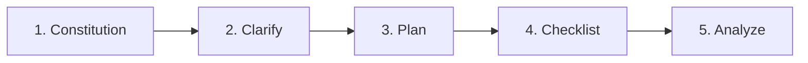

# Pro Tips & Best Practices

> Expert-level tips for maximizing productivity with Boring. From beginners to senior developers.

---

## 🎯 For Beginners

### Start with Vibe Coding
```
You: /vibe_start Build a to-do app with React
Boring: Let me ask some questions first...
       1. Do you want authentication?
       2. Local storage or database?
       3. Any specific styling framework?
```

**Why it works**: Vibe start guides you through requirements before coding.

### Use Quick Fix Often
```
/quick_fix
```
Automatically fixes all linting errors, import sorting, and formatting issues.

### Let AI Read Your Errors
```
You: I'm getting "ModuleNotFoundError: No module named 'foo'"
Boring: Encountered ❌ ModuleNotFoundError.
        Running Active Recall...
        Found pattern: "Missing dependency"
        Solution: pip install foo
```

---

## ⚡ For Intermediate Developers

### Tip 1: SpecKit Workflow

Before writing code, use the 5-step specification workflow:



> **"Measure Twice, Cut Once"** - AI implementation!

### Tip 2: Use Hybrid Mode

| Task Type | Recommended Approach |
|-----------|---------------------|
| Small bug fixes | `boring_apply_patch` |
| New features | `boring start` + SpecKit |
| Code review | `boring_code_review` |
| Refactoring | `boring_checkpoint` + `boring run` |

### Tip 3: Incremental Verification

```bash
# Only verify changed files (fast!)
boring verify --incremental

# Force full verification before release
boring verify --force --level FULL
```

### Tip 4: Accumulate Knowledge

```
Develop → AI fixes errors → Recorded in .boring/memory
Project ends → boring_learn → Patterns saved to .boring/brain
Next project → AI auto-references past solutions!
```

---

## 🚀 For Senior Developers

### Tip 5: Custom Quality Rules

Create `.boring.toml` with project-specific settings:

```toml
[boring.quality_gates]
min_coverage = 80              # High bar for production
max_complexity = 10            # Keep it simple
max_file_lines = 300           # Smaller files

[boring.linter_configs]
ruff_line_length = 100
ruff_ignore = ["E501", "W503"]

[boring.prompts]
judge_system = """
You are a senior Python architect focused on:
- SOLID principles
- Clean architecture
- Performance optimization
"""
```

### Tip 6: Multi-Project RAG

```python
boring_rag_search(
    query="authentication middleware",
    additional_roots=[
        "/path/to/shared-libs",
        "/path/to/other-project"
    ]
)
```

Search across multiple codebases simultaneously.

### Tip 7: Contrastive Evaluation

```python
# Compare two implementations
boring_evaluate(
    level="PAIRWISE",
    target_a="src/auth_v1.py",
    target_b="src/auth_v2.py"
)
```

AI judges which implementation is better, with bias mitigation.

### Tip 8: Security Sandbox with Shadow Mode
```python
# Set STRICT mode for production
boring_shadow_mode(action="set_level", level="STRICT")
```

---

## 🧠 Cognitive Evolution (V11.2)

### Tip 9: Levering Deep Thinking
Use "Deep Thinking" for architectural decisions or complex refactors. 
```
"Analyze this architecture using Deep Thinking and suggest 3 refactoring paths."
```

### Tip 10: Critical Thinking Audit
Use "Critical Thinking" for security reviews or logic verification.
```
"Perform a Critical Thinking audit on this payment flow for potential race conditions."
```

### Tip 11: Cross-Project Knowledge Sharing {: #tip-11 }

```bash
# On project completion
boring_global_export --all

# Knowledge saved to ~/.boring/brain/
# Available for all future projects via Active Recall
```

---

## 🏢 For Teams

### Tip 12: Shared Configuration

```bash
# Commit .boring.toml to repo
git add .boring.toml
git commit -m "Add team quality standards"
```

Everyone uses the same quality gates.

### Tip 13: CI/CD Integration

```yaml
# .github/workflows/quality-gates.yml
jobs:
  verify:
    steps:
      - uses: actions/checkout@v4
      - run: pip install boring-aicoding
      - run: boring verify --level FULL
```

### Tip 11: Cross-Project Knowledge Sharing {: #tip-11 }

```bash
# On project completion
boring_global_export --all

# Knowledge saved to ~/.boring/brain/
# Available for all future projects via Active Recall
```

---

## 🔧 Performance Tips

### Tip 12: Warm the Cache

```bash
# First run builds cache
boring verify

# Subsequent runs are fast
boring verify  # Uses cache
```

### Tip 13: Parallel Verification

```toml
# .boring.toml
[boring.performance]
parallel_workers = 8  # Use all CPU cores
```

### Tip 14: Selective RAG Indexing

```bash
# Only index specific directories
boring rag index --paths "src/" "lib/"
```

---

## 🛡️ Security Tips

### Tip 15: Always Use Shadow Mode in Production

```yaml
# smithery.yaml or MCP config
SHADOW_MODE_LEVEL: "STRICT"
BORING_ALLOW_DANGEROUS: false
```

### Tip 16: Protected File Operations

```python
# Use boring_write_file instead of native write_file
boring_write_file(path="config.py", content="...")
```

### Tip 17: Secret Scanning

```bash
# Scan before commit
boring_security_scan --scan-type secrets
```

---

## See Also

- [Quick Tutorials](./quick-tutorials.md) - Step-by-step guides
- [MCP Tools](../features/mcp-tools.md) - Tool reference
- [Quality Gates](../features/quality-gates.md) - CI/CD setup
