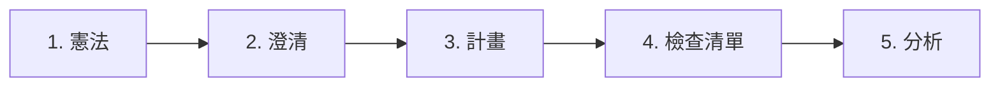

# 專業技巧與最佳實踐

> 最大化 Boring 生產力的專家級技巧。從初學者到資深開發者。

---

## 🎯 初學者

### 從 Vibe Coding 開始
```
你：/vibe_start 建立一個 React 待辦事項應用
Boring：讓我先問幾個問題...
       1. 需要認證功能嗎？
       2. 本地儲存還是資料庫？
       3. 有特定的樣式框架嗎？
```

**為什麼有效**：Vibe start 在編碼前引導你完成需求。

### 經常使用 Quick Fix
```
/quick_fix
```
自動修復所有 linting 錯誤、import 排序和格式問題。

### 讓 AI 閱讀你的錯誤
```
你：我遇到 "ModuleNotFoundError: No module named 'foo'"
Boring：執行 boring_diagnose... 
        解決方案：pip install foo
```

---

## ⚡ 中級開發者

### 技巧 1：SpecKit 工作流程

在寫代碼之前，使用 5 步驟規格工作流程：



> **「量兩次，切一次」** - AI 實作版！

### 技巧 2：使用混合模式

| 任務類型 | 建議方法 |
|----------|----------|
| 小型錯誤修復 | `boring_apply_patch` |
| 新功能 | `boring_multi_agent` + SpecKit |
| 代碼審查 | `boring_evaluate` |
| 重構 | `boring run "重構 X"` |

### 技巧 3：增量驗證

```bash
# 只驗證變更的檔案（快速！）
boring verify --incremental

# 發布前強制完整驗證
boring verify --force --level FULL
```

### 技巧 4：累積知識

```
開發 → AI 修復錯誤 → 記錄到 .boring/memory
專案結束 → boring_learn → 模式儲存到 .boring/brain
下個專案 → AI 自動參考過去的解決方案！
```

---

## 🚀 資深開發者

### 技巧 5：自訂品質規則

建立 `.boring.toml` 包含專案特定設定：

```toml
[boring.quality_gates]
min_coverage = 80              # 生產環境高標準
max_complexity = 10            # 保持簡單
max_file_lines = 300           # 較小的檔案

[boring.linter_configs]
ruff_line_length = 100
ruff_ignore = ["E501", "W503"]

[boring.prompts]
judge_system = """
你是一位資深 Python 架構師，專注於：
- SOLID 原則
- 乾淨架構
- 效能優化
"""
```

### 技巧 6：多專案 RAG

```python
boring_rag_search(
    query="authentication middleware",
    additional_roots=[
        "/path/to/shared-libs",
        "/path/to/other-project"
    ]
)
```

同時搜尋多個程式碼庫。

### 技巧 7：對比評估

```python
# 比較兩個實作
boring_evaluate(
    level="PAIRWISE",
    target_a="src/auth_v1.py",
    target_b="src/auth_v2.py"
)
```

AI 判斷哪個實作更好，並減少偏見。

### 技巧 8：代碼審查用影子模式

```python
# 審查者設定 STRICT 模式
boring_shadow_mode(action="set_level", level="STRICT")

# 所有 AI 變更都需要批准
# 適合生產代碼審查
```

---

## 🏢 團隊

### 技巧 9：共享配置

```bash
# 將 .boring.toml 提交到 repo
git add .boring.toml
git commit -m "新增團隊品質標準"
```

每個人使用相同的品質閘道。

### 技巧 10：CI/CD 整合

```yaml
# .github/workflows/quality-gates.yml
jobs:
  verify:
    steps:
      - uses: actions/checkout@v4
      - run: pip install boring-aicoding
      - run: boring verify --level FULL
```

### 技巧 11：跨專案知識分享

```bash
# 專案完成時
boring_learn --topics "error-handling,testing,patterns"

# 知識儲存到 ~/.boring/brain/
# 所有未來專案都可用
```

---

## 🔧 效能技巧

### 技巧 12：預熱快取

```bash
# 第一次執行建立快取
boring verify

# 後續執行很快
boring verify  # 使用快取
```

### 技巧 13：平行驗證

```toml
# .boring.toml
[boring.performance]
parallel_workers = 8  # 使用所有 CPU 核心
```

### 技巧 14：選擇性 RAG 索引

```bash
# 只索引特定目錄
boring rag index --paths "src/" "lib/"
```

---

## 🛡️ 安全技巧

### 技巧 15：生產環境始終使用影子模式

```yaml
# smithery.yaml 或 MCP 配置
SHADOW_MODE_LEVEL: "STRICT"
BORING_ALLOW_DANGEROUS: false
```

### 技巧 16：受保護的檔案操作

```python
# 使用 boring_write_file 而非原生 write_file
boring_write_file(path="config.py", content="...")
```

### 技巧 17：密鑰掃描

```bash
# 提交前掃描
boring_security_scan --scan-type secrets
```

---

## 另請參閱

- [快速教學](./quick-tutorials_zh.md) - 逐步指南
- [MCP 工具](../features/mcp-tools_zh.md) - 工具參考
- [品質閘道](../features/quality-gates_zh.md) - CI/CD 設定
