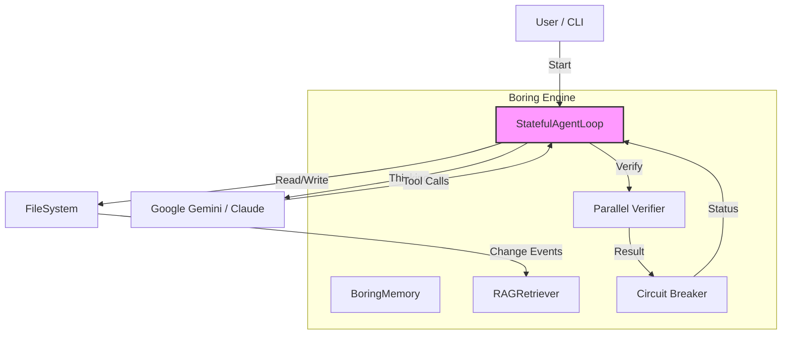
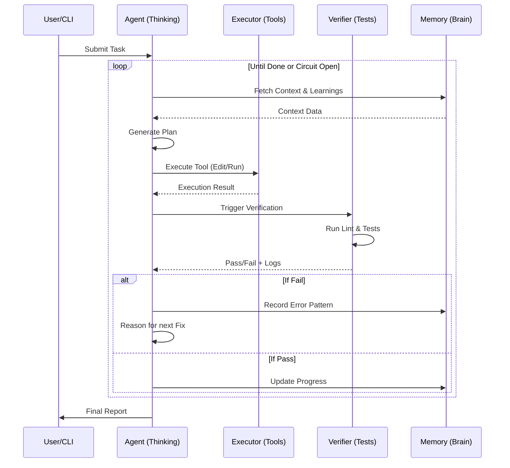
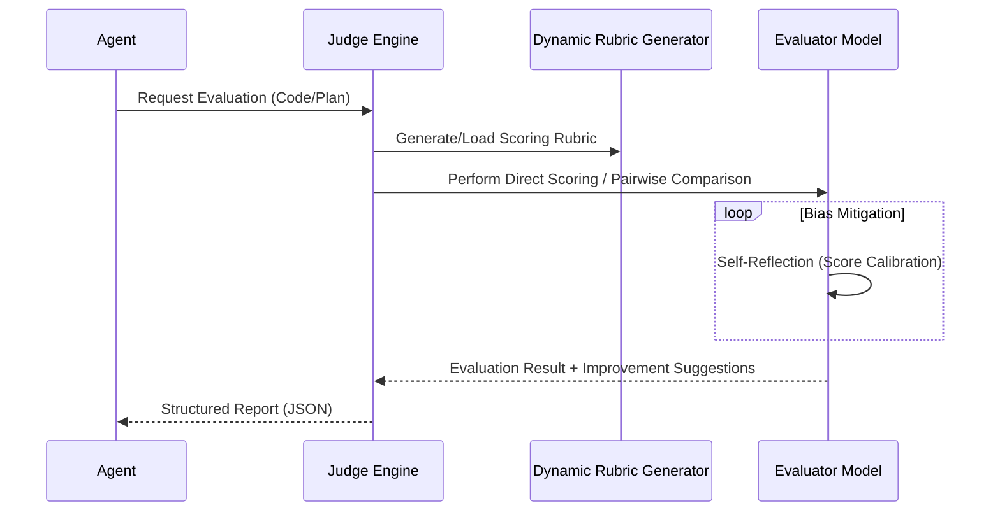

# Architecture & Internals

> Understanding how Boring works under the hood.

---

## 🏗️ System Architecture

Boring is built on a **Stateful Autonomous Loop** pattern.



## 🔄 The Development Loop Process

Boring follows a continuous feedback loop to ensure code correctness.



### 1. Modular Core & Lazy Loading (`src/boring/`)

Starting from v10.28.0, Boring uses a **Diet Architecture**:
- **Lazy Loading**: Heavily utilizes `__getattr__` in `__init__.py` to import submodules ONLY when accessed. This dropped cold startup time from ~2.5s to **< 600ms**.
- **Dependency Manager**: A centralized `DependencyManager` (in `core/dependencies.py`) handles all optional "Extras" (ChromaDB, FastAPI, Streamlit), ensuring the core CLI remains lightweight (< 50MB).

### 2. Submodule Reconstruction

The source is organized into specific functional layers:
- `core/`: Constants, telemetry, and dependency management.
- `services/`: Core logic like health checks and monitoring.
- `cli/`: Typer-based interface and command definitions.
- `tools/`: Atomic tools for file manipulation and analysis.
- `intelligence/`: Memory (Brain), RAG, and pattern learning.
- `loop/`: The autonomous state machine.
- `mcp/`: Model Context Protocol server and tool exposure.

### 3. The Brain & Memory (`src/boring/intelligence/`)

Boring doesn't just read files; it maintains "state":
- **Context (`context.json`)**: Current task, plan, and progress.
- **Learnings (`learnings.json`)**: Error patterns and successful fixes.
- **RAG Index (ChromaDB)**: [OPTIONAL] Vector embeddings of the codebase for semantic search.

#### 🕵️ Hybrid RAG Workflow

Boring employs a multi-tiered retrieval strategy to ensure context precision:

```mermaid
graph LR
    Query[User Query] --> HybridSearch
    
    subgraph "Hybrid Search Engine"
        HybridSearch --> Keyword[Keyword Search (BM25)]
        HybridSearch --> Vector[Vector Search (ChromaDB)]
        
        Keyword --> Merger[Merge & Rerank Results]
        Vector --> Merger
    end
    
    Merger --> TopK[Top-K Candidates]
    
    subgraph "Graph Expansion"
        TopK --> DepGraph[Dependency Graph Analysis]
        DepGraph --> Callers[Callers]
        DepGraph --> Callees[Callees]
    end
    
    Callers --> FinalContext[Final Context]
    Callees --> FinalContext
    TopK --> FinalContext
```

### 3. Evaluation & Judgment (`src/boring/judge/`)

Boring includes a built-in **LLM-as-a-Judge** system for self-evaluation and quality control:



### 4. Verification Engine (`src/boring/verification/`)

Unlike typical agents that just generate code, Boring **verifies** it.

- **Parallel Execution**: Uses `ThreadPoolExecutor` to run linters/tests concurrently.
- **Caching**: Hashes file content to skip re-verification of unchanged files (`.boring_cache`).
- **Layers**:
  - **Static**: Syntax check, linting (ruff, eslint).
  - **Dynamic**: Unit tests (pytest).
  - **Security**: Vulnerability scans (bandit).

### 5. Circuit Breaker (`src/boring/util/circuit_breaker.py`)

Prevents the "Infinite Loop of Doom" where an agent repeatedly tries and fails.

- **CLOSED**: Normal operation.
- **OPEN**: Too many consecutive failures. Stops execution to save tokens/time.
- **HALF_OPEN**: Allows one attempt to see if the issue is resolved.

---

## 🔒 Security Architecture (Shadow Mode)

Boring operates in a "Shadow Mode" sandbox for high-risk operations.

```
Request (Delete File)
       │
       ▼
[Shadow Interceptor]
       │
  Is Safe? (Config) ──▶ YES ──▶ [FileSystem]
       │
       ▼
      NO
       │
  [User Approval UI] ──▶ YES ──▶ [FileSystem]
       │
       ▼
      NO ──▶ [Block & Report]
```

This logic exists in `src/boring/security/shadow_mode.py`.

---

## 🔌 MCP Integration

Boring exposes its internals via the Model Context Protocol (MCP).

- **Tools**: exposed as `boring_tool_name`.
- **Resources**: `boring://logs`, `boring://config`.
- **Prompts**: `/vibe_start`, `/quick_fix`.

This allows Boring to run *inside* other AI clients like Claude Desktop or Cursor.
