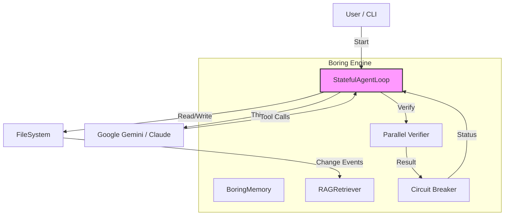
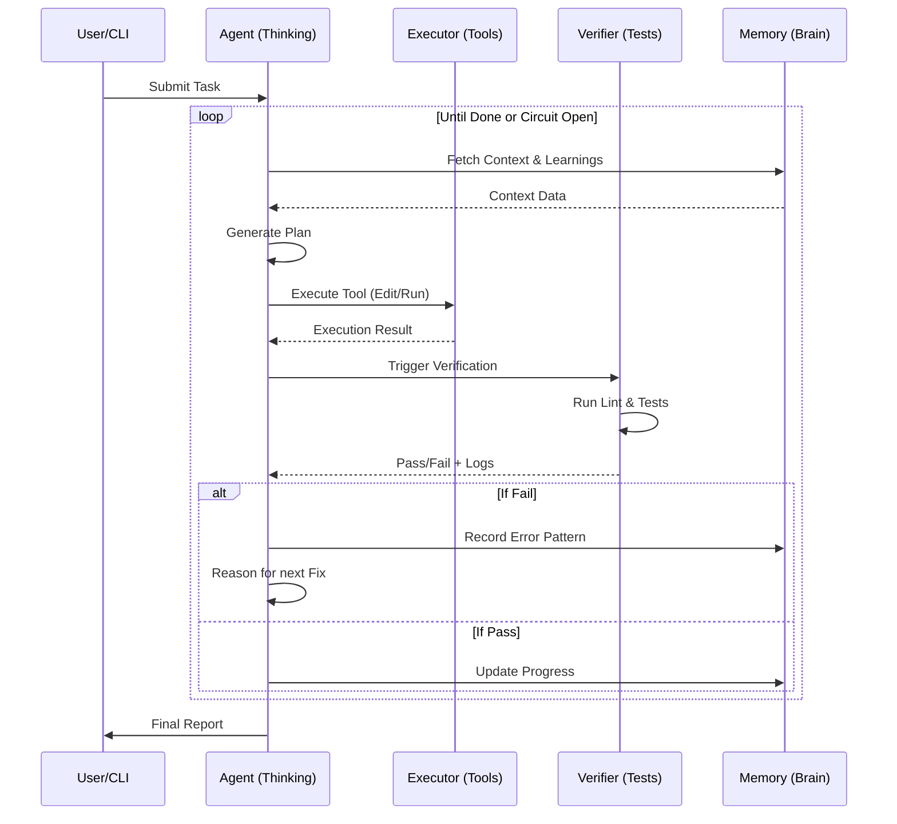

# Architecture & Internals

> Understanding how Boring works under the hood.

---

## 🏗️ System Architecture

Boring is built on a **Stateful Autonomous Loop** pattern.



## 🔄 The Development Loop Process

Boring follows a continuous feedback loop to ensure code correctness.



### 1. The Autonomous Loop (`src/boring/loop/`)

The core is `StatefulAgentLoop`, implementing a Finite State Machine (FSM):

- **THINKING State**: Generates the next action using the LLM.
- **EXECUTING State**: Runs tools (edit files, run commands).
- **VERIFYING State**: Validates changes (lint, test, build).
- **LEARNING State**: Analyzes results and updates memory.

### 2. The Brain & Memory (`src/boring/memory/`)

Boring doesn't just read files; it maintains "state":

- **Context (`context.json`)**: Current task, plan, and progress.
- **Learnings (`learnings.json`)**: Error patterns and successful fixes.
- **RAG Index (ChromaDB)**: Vector embeddings of the codebase for semantic search.

### 3. Verification Engine (`src/boring/verification/`)

Unlike typical agents that just generate code, Boring **verifies** it.

- **Parallel Execution**: Uses `ThreadPoolExecutor` to run linters/tests concurrently.
- **Caching**: Hashes file content to skip re-verification of unchanged files (`.boring_cache`).
- **Layers**:
  - **Static**: Syntax check, linting (ruff, eslint).
  - **Dynamic**: Unit tests (pytest).
  - **Security**: Vulnerability scans (bandit).

### 4. Circuit Breaker (`src/boring/util/circuit_breaker.py`)

Prevents the "Infinite Loop of Doom" where an agent repeatedly tries and fails.

- **CLOSED**: Normal operation.
- **OPEN**: Too many consecutive failures. Stops execution to save tokens/time.
- **HALF_OPEN**: Allows one attempt to see if the issue is resolved.

---

## 🔒 Security Architecture (Shadow Mode)

Boring operates in a "Shadow Mode" sandbox for high-risk operations.

```
Request (Delete File)
       │
       ▼
[Shadow Interceptor]
       │
  Is Safe? (Config) ──▶ YES ──▶ [FileSystem]
       │
       ▼
      NO
       │
  [User Approval UI] ──▶ YES ──▶ [FileSystem]
       │
       ▼
      NO ──▶ [Block & Report]
```

This logic exists in `src/boring/security/shadow_mode.py`.

---

## 🔌 MCP Integration

Boring exposes its internals via the Model Context Protocol (MCP).

- **Tools**: exposed as `boring_tool_name`.
- **Resources**: `boring://logs`, `boring://config`.
- **Prompts**: `/vibe_start`, `/quick_fix`.

This allows Boring to run *inside* other AI clients like Claude Desktop or Cursor.
