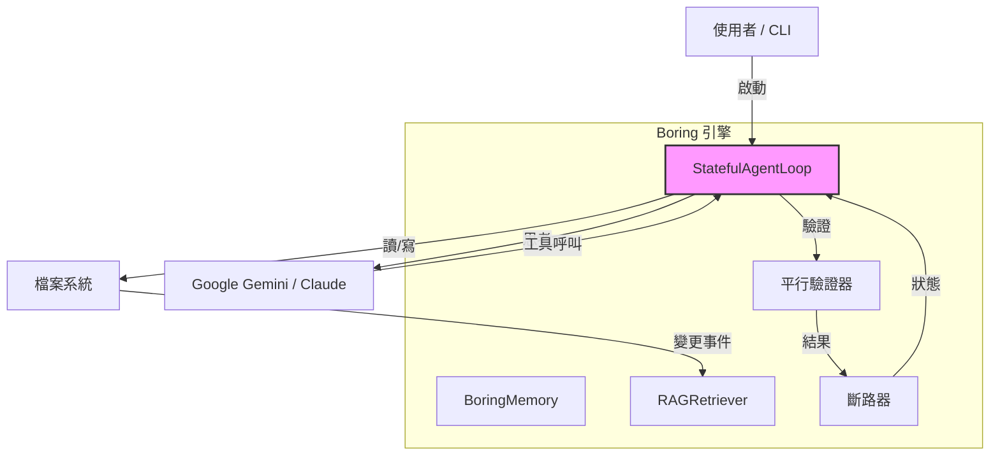
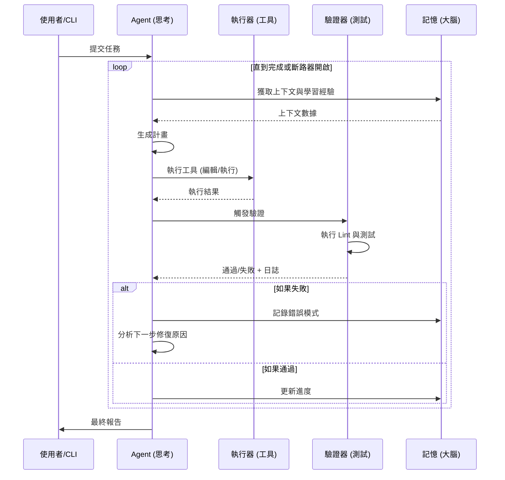
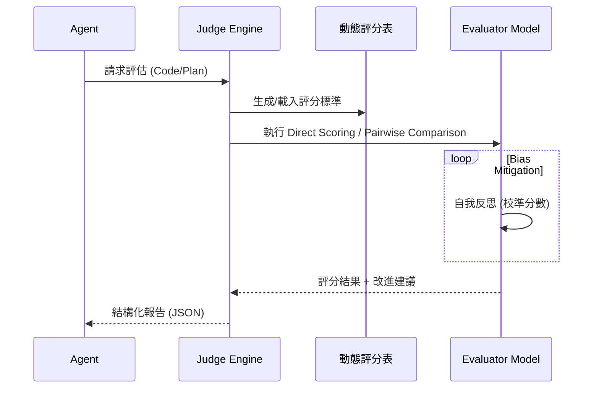

# 架構與內部原理

> 了解 Boring 的內部運作方式。

---

## 🏗️ 系統架構

Boring 建立在 **有狀態自主迴圈 (Stateful Autonomous Loop)** 模式之上。



## 🔄 開發循環流程

Boring 遵循持續回饋循環以確保程式碼的正確性。



### 1. 自主迴圈 (`src/boring/loop/`)

核心是 `StatefulAgentLoop`，實作了一個有限狀態機 (FSM)：

- **THINKING 狀態**：使用 LLM 生成下一個動作。
- **EXECUTING 狀態**：執行工具（編輯檔案、執行命令）。
- **VERIFYING 狀態**：驗證變更（lint、測試、建置）。
- **LEARNING 狀態**：分析結果並更新記憶。

### 2. 大腦與記憶 (`src/boring/memory/`)

Boring 不只是讀取檔案；它維護「狀態」：

- **Context (`context.json`)**：當前任務、計畫和進度。
- **Learnings (`learnings.json`)**：錯誤模式和成功的修復。
- **RAG Index (ChromaDB)**：代碼庫的向量嵌入，用於語意搜尋。

#### 🕵️ 混合 RAG (Hybrid RAG) 工作流

Boring 採用多層檢索策略以確保上下文精確度：

```mermaid
graph LR
    Query[使用者查詢] --> HybridSearch
    
    subgraph "Hybrid Search Engine"
        HybridSearch --> Keyword[關鍵字搜尋 (BM25)]
        HybridSearch --> Vector[向量搜尋 (ChromaDB)]
        
        Keyword --> Merger[結果合併 & 重排序]
        Vector --> Merger
    end
    
    Merger --> TopK[Top-K 初選結果]
    
    subgraph "Graph Expansion"
        TopK --> DepGraph[依賴圖分析]
        DepGraph --> Callers[調用者]
        DepGraph --> Callees[被調用者]
    end
    
    Callers --> FinalContext[最終上下文]
    Callees --> FinalContext
    TopK --> FinalContext
```

### 3. 評估與審判 (`src/boring/judge/`)

Boring 內建 **LLM-as-a-Judge** 系統，用於自我評估與品質控制：



### 4. 驗證引擎 (`src/boring/verification/`)

與只生成代碼的典型 Agent 不同，Boring 會 **驗證** 它。

- **平行執行**：使用 `ThreadPoolExecutor` 並發執行 linter/測試。
- **快取**：對檔案內容進行雜湊，以跳過未變更檔案的重複驗證 (`.boring_cache`)。
- **層級**：
  - **靜態**：語法檢查、linting (ruff, eslint)。
  - **動態**：單元測試 (pytest)。
  - **安全**：漏洞掃描 (bandit)。

### 5. 斷路器 (`src/boring/util/circuit_breaker.py`)

防止 Agent 重複嘗試並失敗的「無限迴圈災難」。

- **CLOSED**：正常運作。
- **OPEN**：連續失敗次數過多。停止執行以節省 Token/時間。
- **HALF_OPEN**：允許一次嘗試，查看問題是否已解決。

---

## 🔒 安全架構（影子模式）

Boring 在高風險操作的「影子模式」沙箱中運作。

```
請求（刪除檔案）
       │
       ▼
[影子攔截器]
       │
  安全嗎？(配置) ──▶ 是 ──▶ [檔案系統]
       │
       ▼
      否
       │
  [使用者批准 UI] ──▶ 是 ──▶ [檔案系統]
       │
       ▼
      否 ──▶ [阻擋並報告]
```

此邏輯存在於 `src/boring/security/shadow_mode.py` 中。

---

## 🔌 MCP 整合

Boring 透過 Model Context Protocol (MCP) 暴露其內部功能。

- **工具**：暴露為 `boring_tool_name`。
- **資源**：`boring://logs`, `boring://config`。
- **提示**：`/vibe_start`, `/quick_fix`。

這允許 Boring 在其他 AI 客戶端（如 Claude Desktop 或 Cursor）*內部* 運行。
